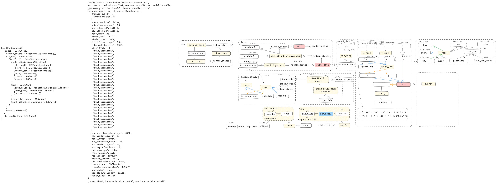
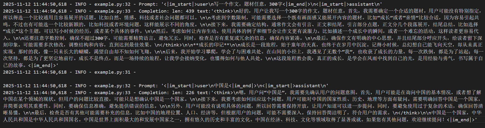

## Nano-vLLM-Ascend

nano-vllm是外网开源的一个gpu推理项目，基于开源版本弄的一个ascend npu版本推理小demo，旨在帮助初学者了解推理的整体流程，区别于vllm，nano-vllm体量更小，麻雀虽小五脏俱全，更有助于初学者学习，非常适合用于相关概念的理解。

## 框架层流程图

## 模型层流程图


## 特性
* 📖 **可读代码库** - 约1200行Python代码的清晰实现
* ⚡ **优化套件** - 张量并行、torchair Ascend IR图编译和图缓存、融合算子、前缀缓存等
- [✅] 待完成：目前只支持单算子, npu图模式实现
- [✅] 支持CPU环境运行：[nano-vllm-cpu 代码仓库](https://github.com/linzm1007/nano-vllm-cpu)
- [✅] 性能优化
- [⏳] 支持模型: Qwen3-0.6B、Qwen3-32B、Qwen2-0.5B、Qwen2.5-0.5B、Qwen2.5-0.5B-Instruct、Llama-3.2-1B-Instruct、Qwen3-30B-A3B、Qwen3-VL-2B-Instruct、MiniCPM4-0.5B
- [✅] 支持一个moe模型:Qwen3-30B-A3B(暂时不支持入图)
- [📅] 支持一个omni模型
- [✅] 支持一个vl模型:Qwen3-VL-2B-Instruct(暂时不支持入图)
- [📅] 实现page attention
- [📅] 实现一个自定义算子
- [📅] 支持在线推理

torchair接口参考 https://www.hiascend.com/document/detail/zh/Pytorch/710/modthirdparty/torchairuseguide/torchair_00008.html
融合算子接口参考 https://www.hiascend.com/document/detail/zh/Pytorch/720/apiref/torchnpuCustomsapi/context/torch_npu-npu_fused_infer_attention_score_v2.md
attention实现参考 https://gitee.com/omniai/omniinfer/blob/master/omni/layers/attention/backend/attention.py  forward_vanilla函数

## 支持的模型
| 架构                   | 模型                    | 示例 HF 模型 |
|----------------------|-----------------------|----------|
| Qwen3ForCausalLM     | Qwen3-0.6B,Qwen3-32B  |          |
| Qwen2ForCausalLM     | Qwen2-0.5B            |          |
| LlamaForCausalLM     | Llama-3.2-1B-Instruct |          |
| Qwen3MoeForCausalLM  | Qwen3-30B-A3B         |          |
| Qwen3VLForConditionalGeneration | Qwen2.5-VL-3B-Instruct |          |
| MiniCPMForCausalLM   | MiniCPM4-0.5B         |          |

## bench数据
仅供参考，硬软条件不同，跑出的数据也会有差异
#### 不同模型对比
| model                 | Output Tokens | Time (s) | Throughput (tokens/s) | TP |
|-----------------------|---------------|----------|-----------------------|----|
| Qwen3-0.6B            | 143,770       | 36.82    | 3904.20               | 1  |
| Qwen2-0.5B            | 143,770       | 20.71    | 6940.84               | 1  |
| Qwen2.5-0.5B-Instruct | 143,770       | 19.82    | 7252.67               | 1  |
| Llama-3.2-1B-Instruct | 143,770       | 25.45    | 5648.50               | 1  |
| Qwen3-32B             | 143,770       | 206.69   | 695.59               | 2  |
| Qwen3-32B             | 143,770       | 119.86   | 1199.50               | 4  |


#### 其他框架对比(2025-12-30)
vLLM Nano-vLLM 数据来源 https://github.com/GeeeekExplorer/nano-vllm

| Inference Engine                  | Output Tokens | Time (s) | Throughput (tokens/s) |
|-----------------------------------|-------------|----------|-----------------------|
| vLLM                              | 133,966     | 98.37    | 1361.84               |
| Nano-vLLM                         | 133,966     | 93.41    | 1434.13               |
| Nano-vLLM-Ascend python torch原生实现 | 4805     | 257.49    | 18.66               | 
| Nano-vLLM-Ascend 融合算子+图编译bs=256   | 133,966  | 33.88    | 3954.20               |

#### 图模式不同bs对比(2025-12-30)

| Batch Size | Output Tokens | Time (s) | Throughput (tokens/s) |
|------------|---------------|----------|-----------------------|
| bs=16      | 133,966       | 107.23   | 1249.37               |
| bs=32      | 133,966       | 75.89    | 1765.35               |
| bs=48      | 133,966       | 64.84    | 2066.22               |
| bs=64      | 133,966       | 54.06    | 2478.31               |
| bs=128     | 133,966       | 43.08    | 3109.56               |
| bs=256     | 133,966       | 33.88    | 3954.20               |

#### 单算子Padding和Non-padding对比(2025-12-30)
bs=256

| Prepare Strategy | Output Tokens | Time (s) | Throughput (tokens/s) |
|------------------|---------------|----------|-----------------------|
| Padding          | 133,966       | 158.46   | 845.41                |
| Non-padding      | 133,966       | 152.14   | 880.55                |

## 环境（参考vllm-ascend）
https://docs.vllm.ai/projects/vllm-ascend-cn/zh-cn/latest/quick_start.html

ubuntu
```
# Update DEVICE according to your device (/dev/davinci[0-7])
export DEVICE=/dev/davinci0
# Update the vllm-ascend image
# Atlas A2:
# export IMAGE=quay.io/ascend/vllm-ascend:v0.14.0rc1
# Atlas A3:
# export IMAGE=quay.io/ascend/vllm-ascend:v0.14.0rc1-a3
export IMAGE=quay.io/ascend/vllm-ascend:v0.14.0rc1
docker run --rm \
--name vllm-ascend \
--shm-size=1g \
--device $DEVICE \
--device /dev/davinci_manager \
--device /dev/devmm_svm \
--device /dev/hisi_hdc \
-v /usr/local/dcmi:/usr/local/dcmi \
-v /usr/local/bin/npu-smi:/usr/local/bin/npu-smi \
-v /usr/local/Ascend/driver/lib64/:/usr/local/Ascend/driver/lib64/ \
-v /usr/local/Ascend/driver/version.info:/usr/local/Ascend/driver/version.info \
-v /etc/ascend_install.info:/etc/ascend_install.info \
-v /root/.cache:/root/.cache \
-p 8000:8000 \
-it $IMAGE bash
# Install curl
apt-get update -y && apt-get install -y curl
```

## 安装依赖
```bash
pip install .
```

## 模型下载

```bash
huggingface-cli download --resume-download Qwen/Qwen3-0.6B \
  --local-dir ~/huggingface/Qwen3-0.6B/ \
  --local-dir-use-symlinks False
```

## 快速开始

请参见 example.py 了解用法。该 API 与 vLLM 的接口基本一致，仅在 LLM.generate 方法上存在一些细微差异：
```python
from nanovllm import LLM, SamplingParams
llm = LLM("/YOUR/MODEL/PATH", enforce_eager=True, tensor_parallel_size=1)
sampling_params = SamplingParams(temperature=0.6, max_tokens=256)
prompts = ["Hello, Nano-vLLM."]
outputs = llm.generate(prompts, sampling_params)
outputs[0]["text"]
```

## example运行结果


## 环境
仅供参考
ascend-dmi -c #查看
* 硬件环境​：
  * 1.显卡:A3 910C
  * 2.驱动版本:24.1.rc3.10
  * 3.固件版本:7.5.0.109.220
* ​软件环境​：
  * 1.CANN包 8.3.RC1
  * 2.PTA版本：torch-npu 2.5.1.post2+gitd7a85f8，torch 2.5.1

## Benchmark

See `bench.py` for benchmark.

**Test Configuration:**
- Model: Qwen3-0.6B
- Total Requests: 256 sequences
- Input Length: Randomly sampled between 100–1024 tokens
- Output Length: Randomly sampled between 100–1024 tokens

**Performance Results:**
Nano-vLLM-Ascend 实在太慢了只跑了10条seq

| Inference Engine | Output Tokens | Time (s) | Throughput (tokens/s) |
|----------------|-------------|----------|-----------------------|
| vLLM           | 133,966     | 98.37    | 1361.84               |
| Nano-vLLM      | 133,966     | 93.41    | 1434.13               |
| Nano-vLLM-Ascend| 4805     | 257.49    | 18.66               |


## qwen3-0.6B layers
```angular2html
ModuleList(
  (0-27): 28 x Qwen3DecoderLayer(
    (self_attn): Qwen3Attention(
      (qkv_proj): QKVParallelLinear()
      (o_proj): RowParallelLinear()
      (rotary_emb): RotaryEmbedding()
      (attn): Attention()
      (q_norm): RMSNorm()
      (k_norm): RMSNorm()
    )
    (mlp): Qwen3MLP(
      (gate_up_proj): MergedColumnParallelLinear()
      (down_proj): RowParallelLinear()
      (act_fn): SiluAndMul()
    )
    (input_layernorm): RMSNorm()
    (post_attention_layernorm): RMSNorm()
  )
)

```
