# BlockManager 流程图

## Block 结构

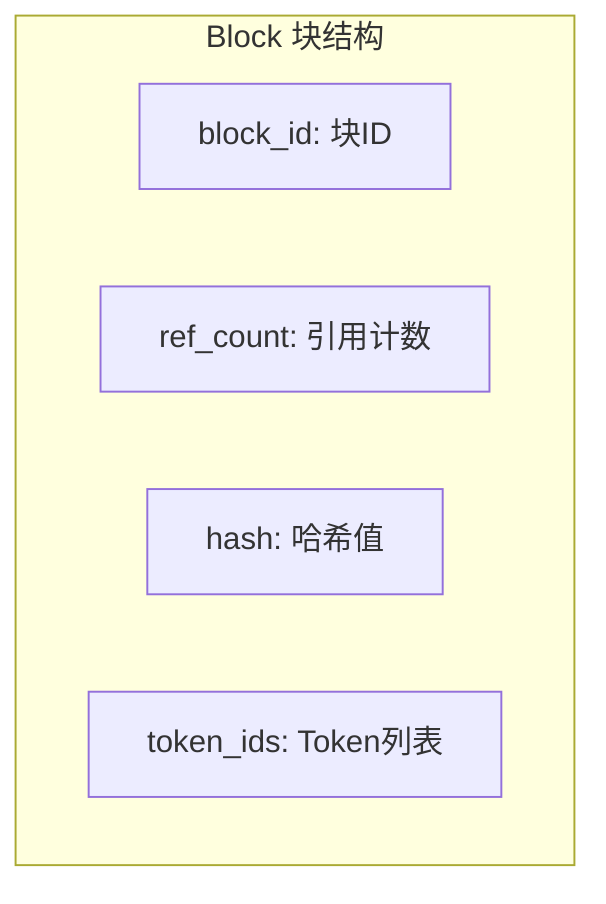

## BlockManager 初始化

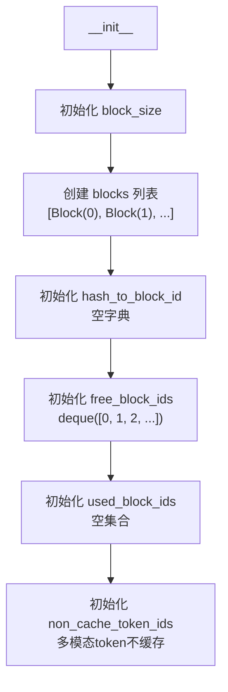

## 块分配流程 (allocate)

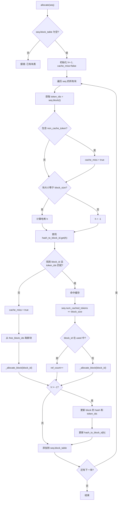

## 块释放流程 (deallocate)

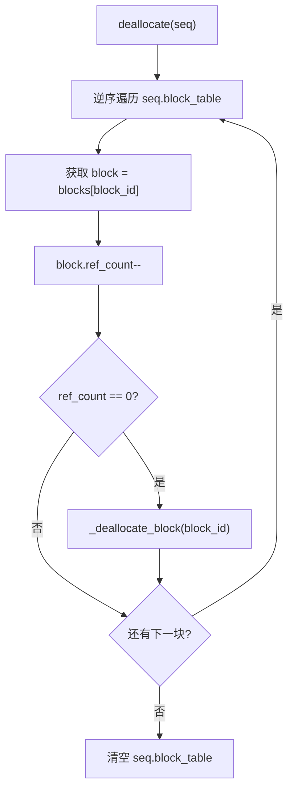

## _allocate_block 内部流程

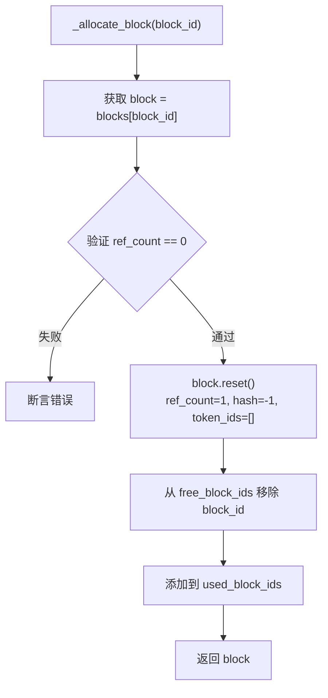

## _deallocate_block 内部流程

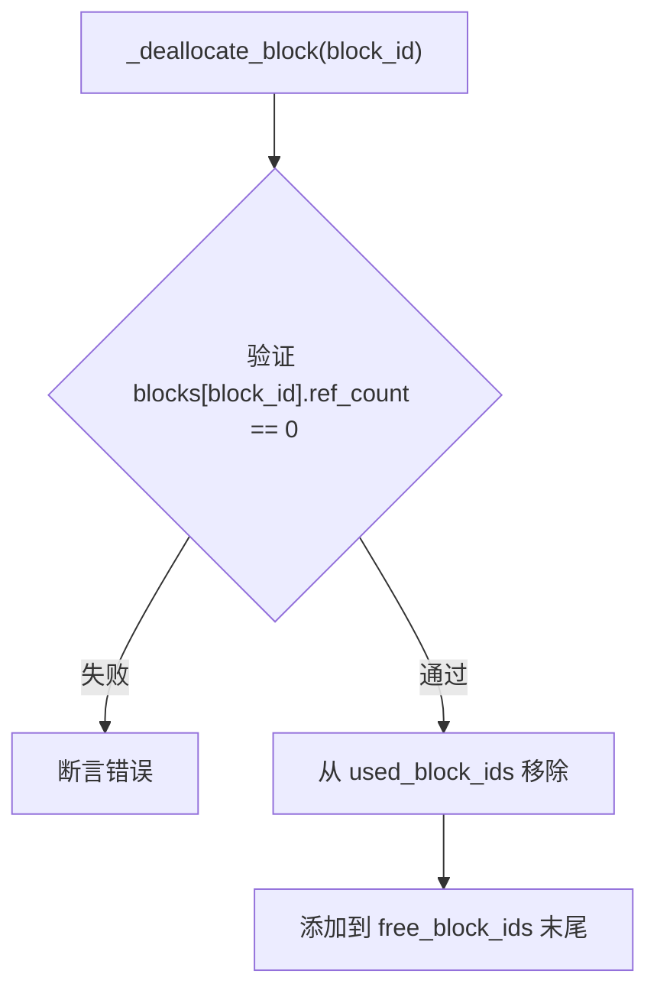

## 哈希计算 (compute_hash)

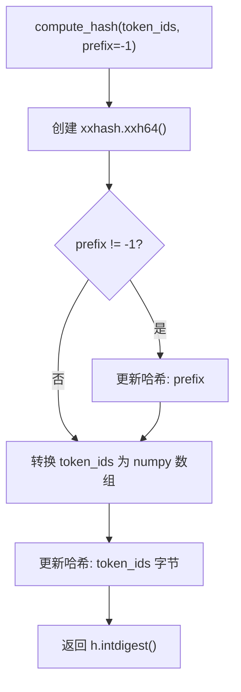

## 是否能分配 (can_allocate)

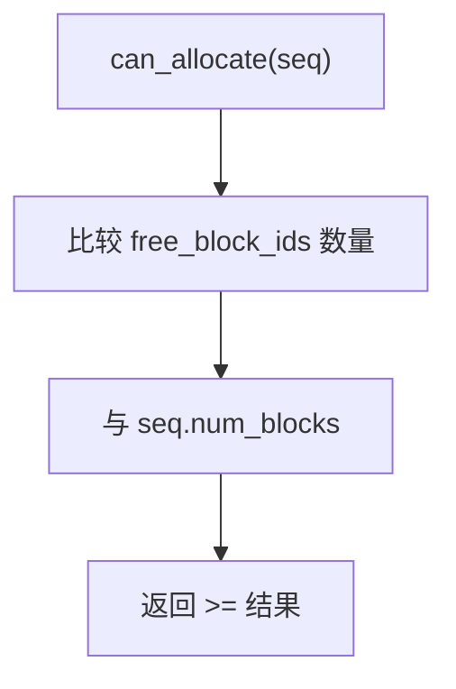

## 是否能追加 (can_append)

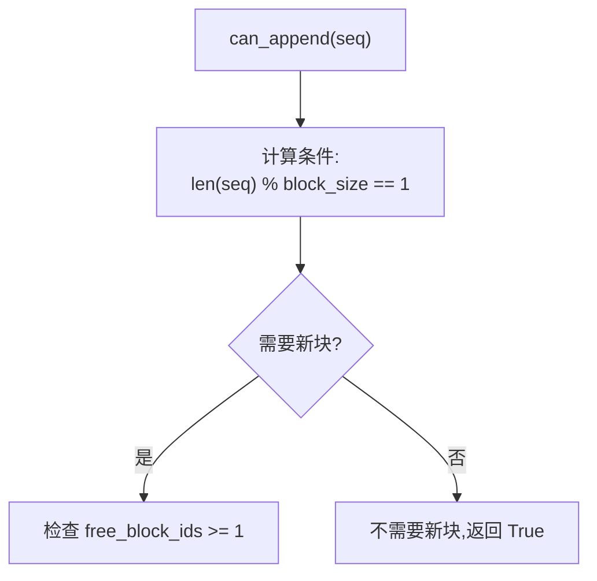

## 可能追加 (may_append)

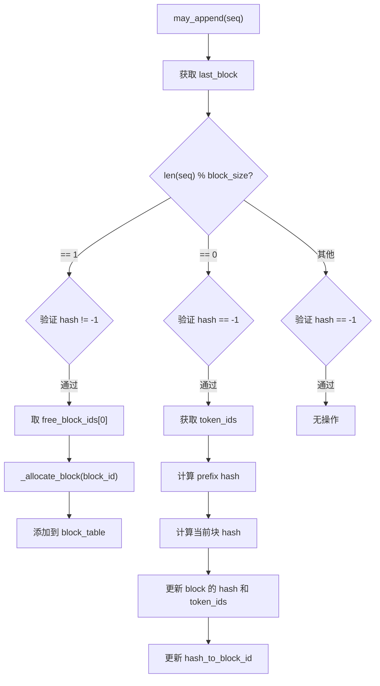

## 缓存命中机制

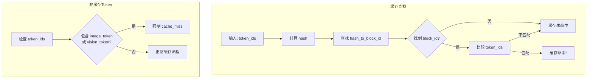
