# LLMEngine 流程图

## LLMEngine 整体架构

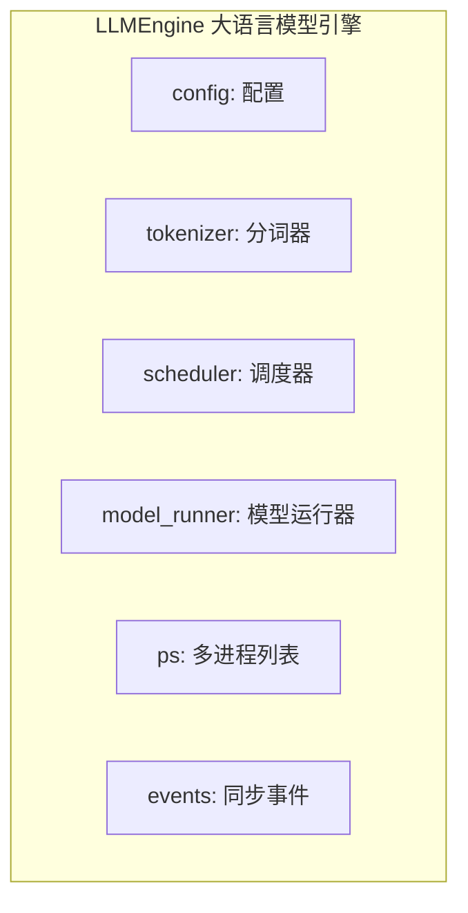

## 初始化流程 (__init__)

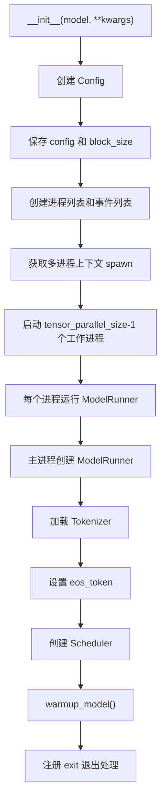

## Warmup 流程

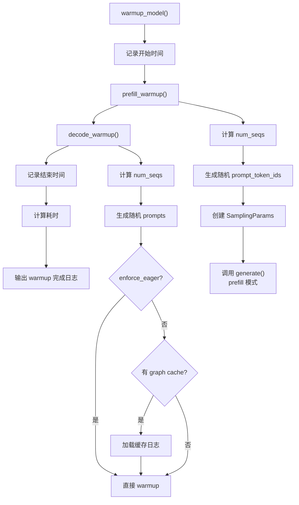

## 添加请求 (add_request)

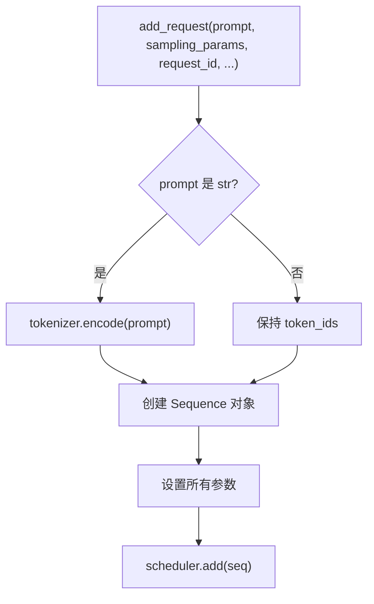

## Step 执行流程

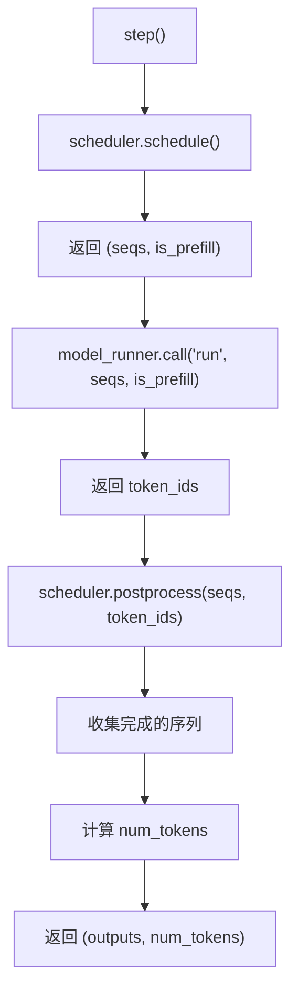

## Generate 主流程

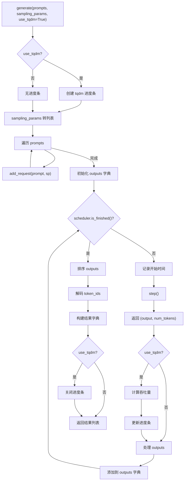

## 多模态生成流程

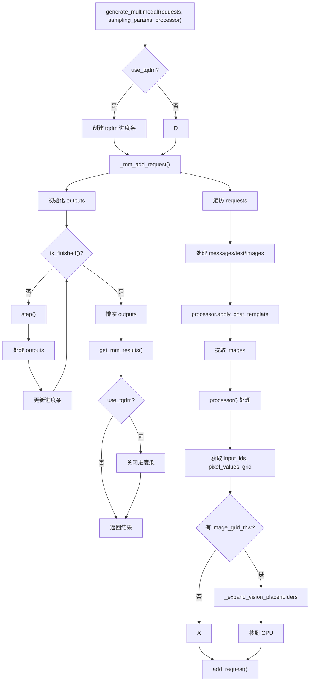

## 视觉占位符扩展流程

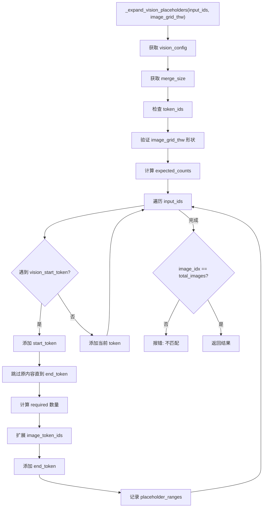

## 退出流程 (exit)

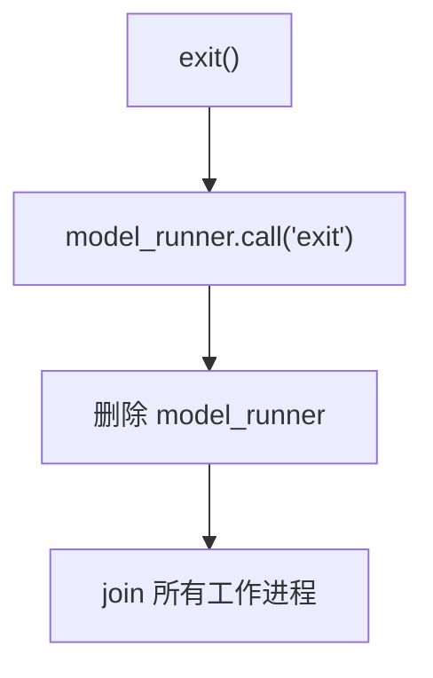

## 请求取消流程

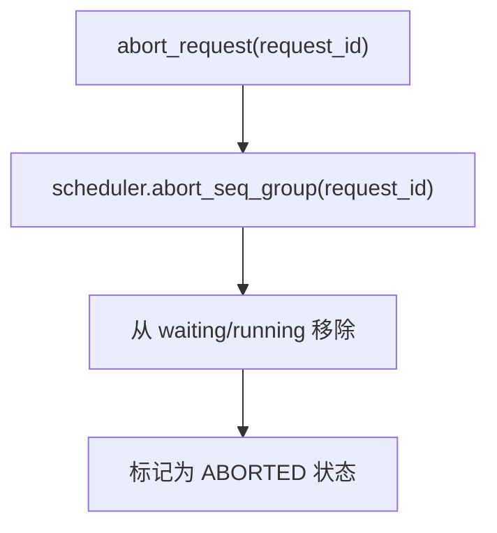

## LLMEngine 数据流向

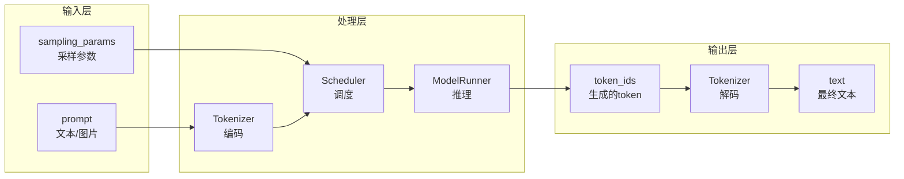

## 主循环时序图

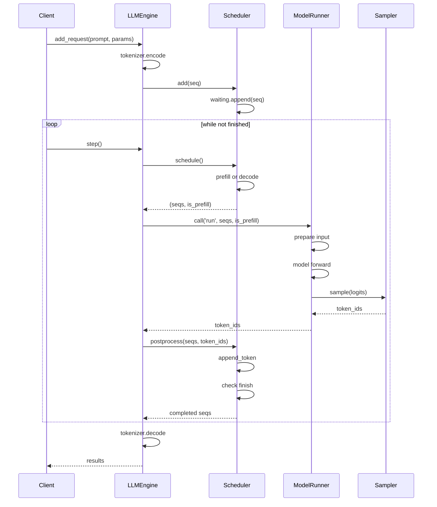
