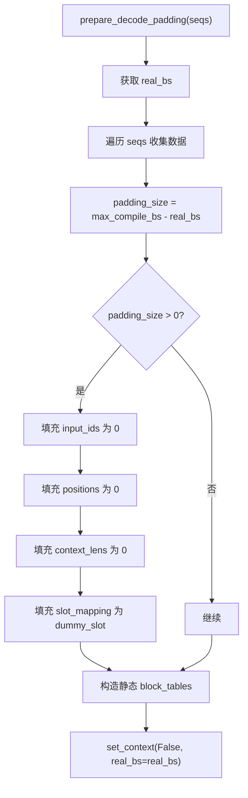

# ModelRunner 流程图

## ModelRunner 整体架构

## 初始化流程 (__init__)

## KV Cache 分配流程

## 模型编译流程

## 运行流程 (run)

```mermaid
flowchart TD
    A["run(seqs, is_prefill)"] --> B{"is_prefill?"}
    B -->|"是"| C["prepare_prefill(seqs)"]
    B -->|"否"| D{"enforce_eager?"}
    D -->|"是"| E["prepare_decode(seqs)"]
    D -->|"否"| F["prepare_decode_padding(seqs)"]
    C --> G["计算 sequence_lengths"]
    E --> H["获取 vision_slices_per_seq"]
    F --> H
    G --> I["_get_vision_slices_per_seq"]
    H --> J["prepare_sample(seqs)"]
    I --> J
    J --> K["run_model()"]
    K --> L["_advance_vision_offsets()"]
    L --> M["sampler(logits, temperatures)"]
    M --> N["reset_context()"]
    N --> O["返回 token_ids"]
```

## Prefill 准备流程

## Decode 准备流程

## Decode Padding 准备流程

## 模型执行流程 (run_model)

## 视觉特征处理流程

## 多进程通信流程

### 写共享内存 (write_shm)

### 读共享内存 (read_shm)

### 多进程架构

