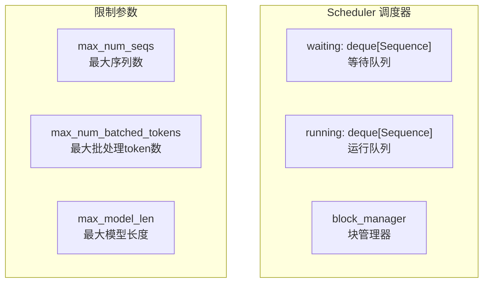
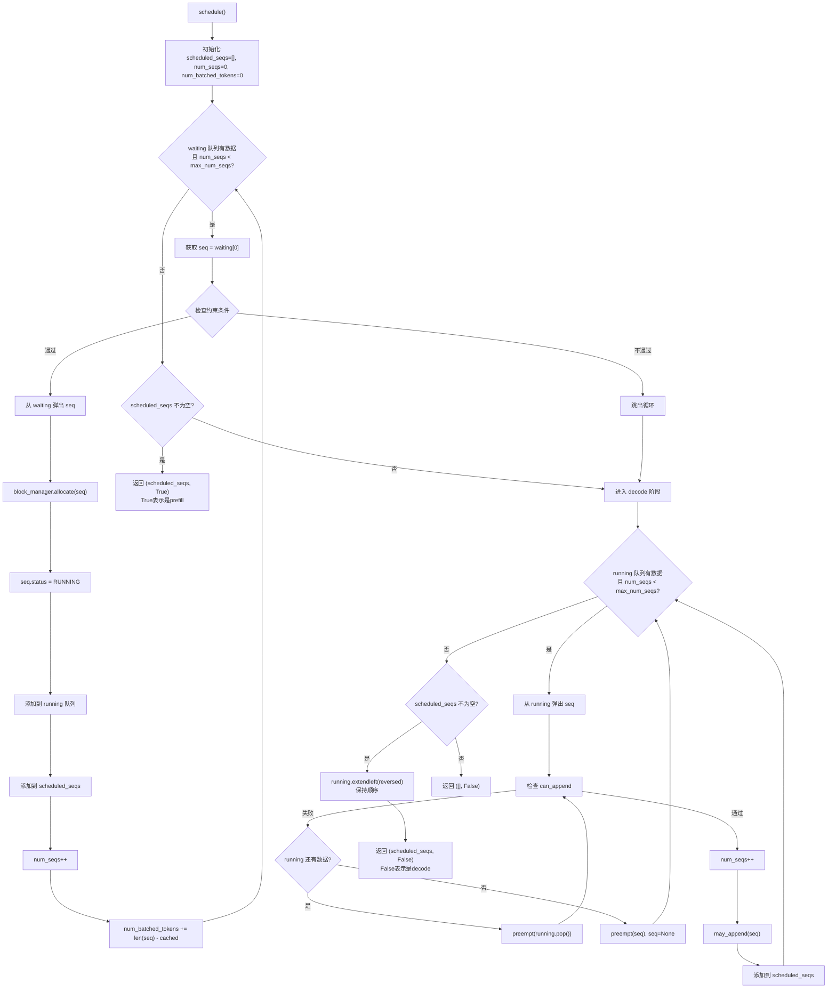
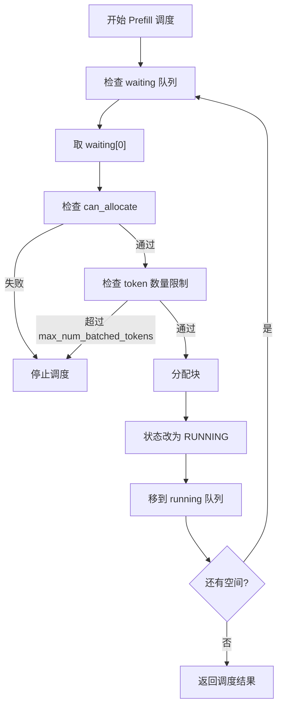
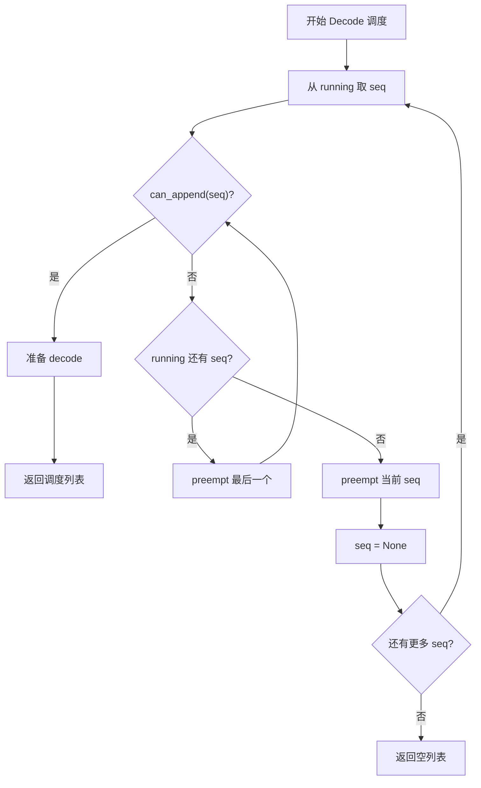
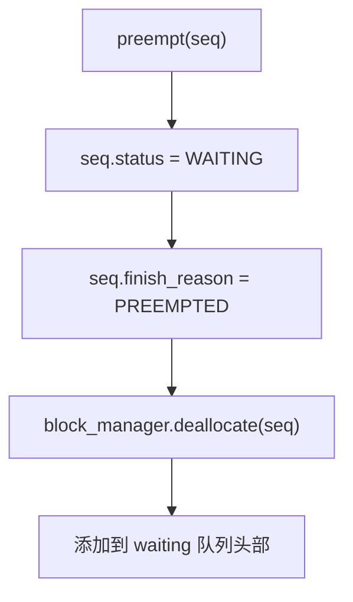
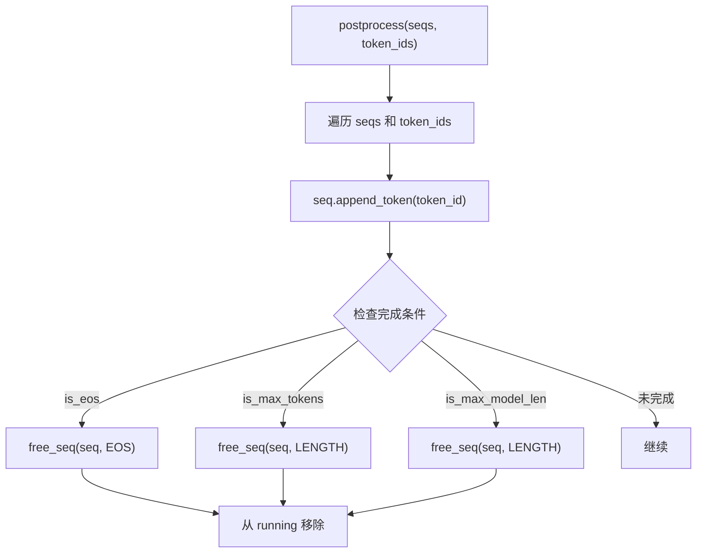
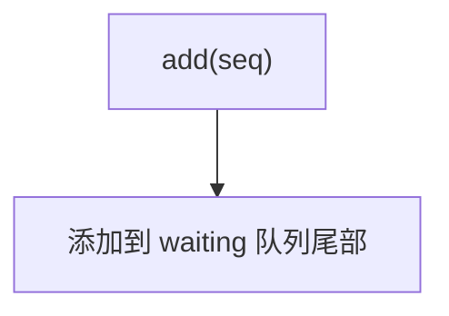
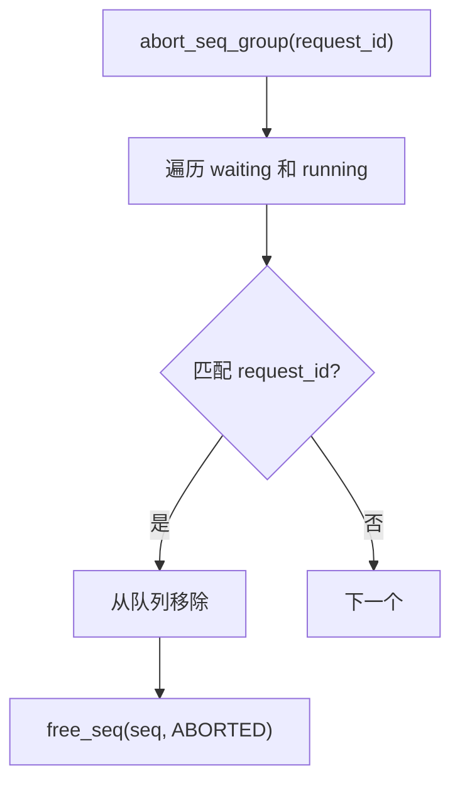
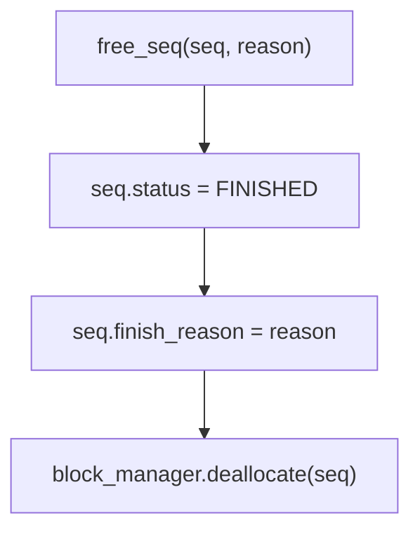
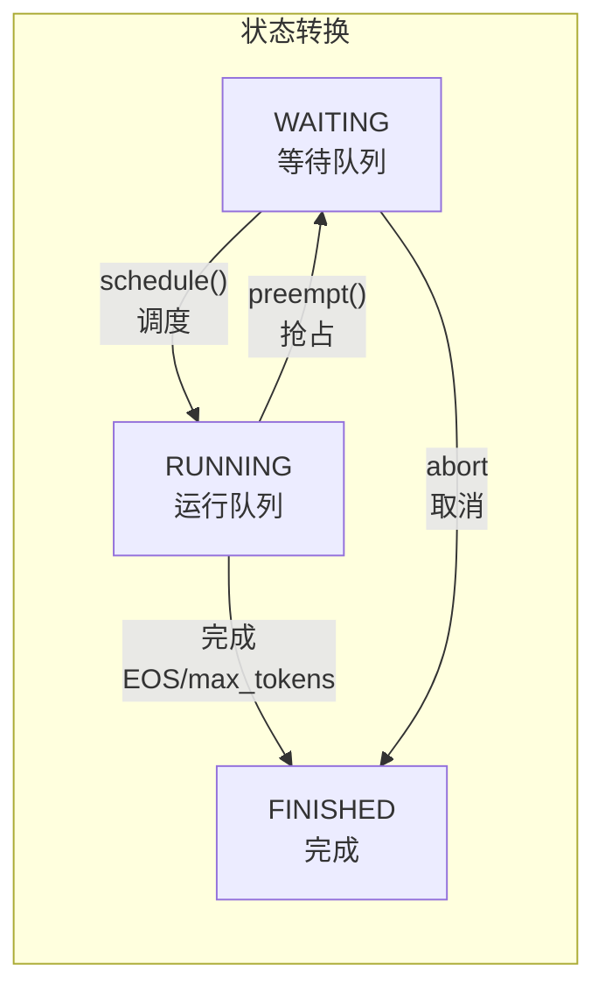

# Scheduler 流程图

## Scheduler 整体架构

## 调度主流程 (schedule)

## Prefill 调度流程

## Decode 调度流程

## 抢占流程 (preempt)

## 后处理流程 (postprocess)

## 添加请求流程 (add)

## 取消请求流程 (abort_seq_group)

## 释放序列 (free_seq)

## 队列状态流转

