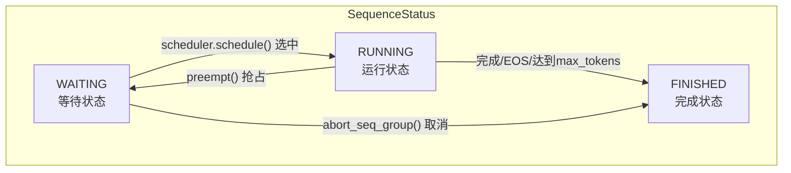
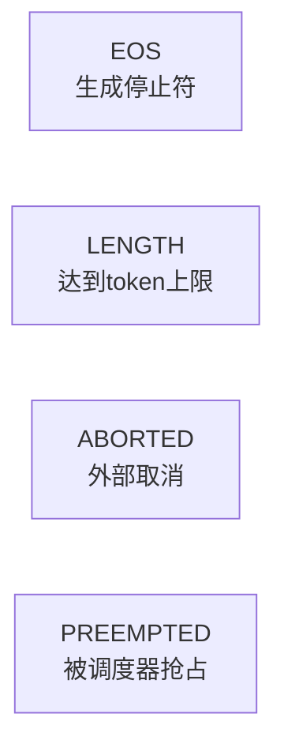
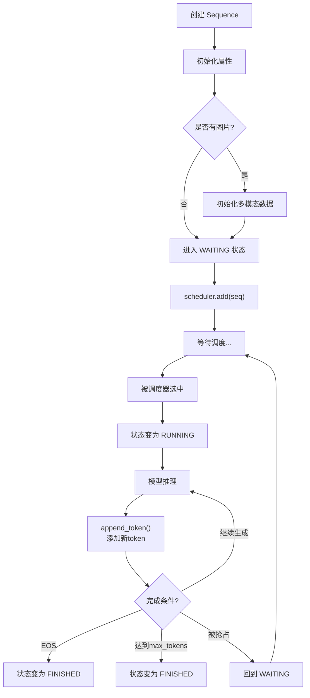
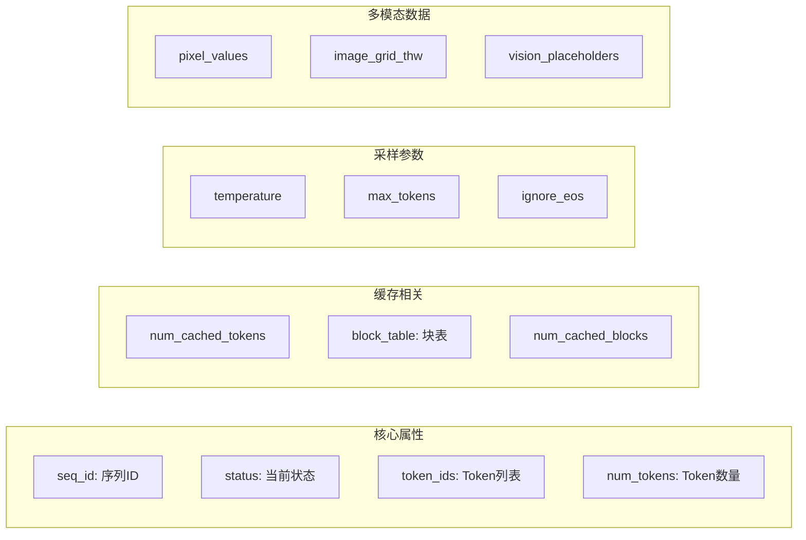
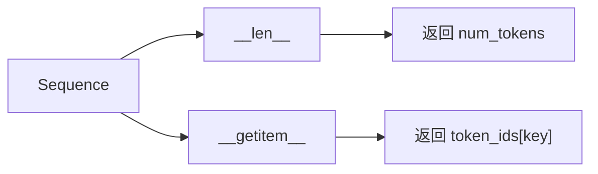
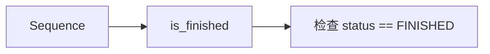
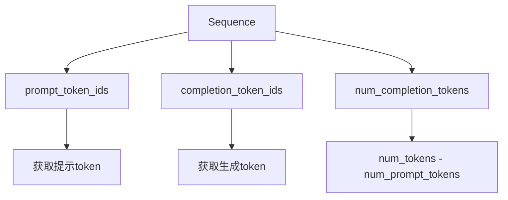
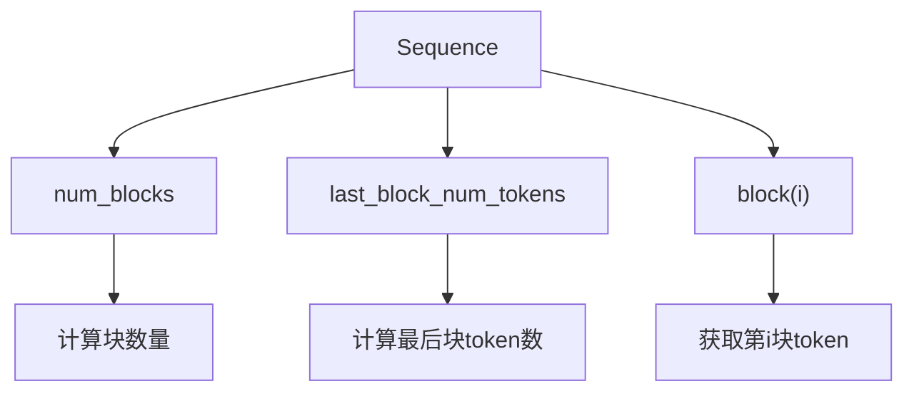
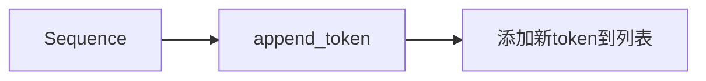

# Sequence 流程图

## Sequence 状态流转图

```mermaid
flowchart TD
    subgraph SequenceStatus
        WAITING["WAITING<br/>等待状态"]
        RUNNING["RUNNING<br/>运行状态"]
        FINISHED["FINISHED<br/>完成状态"]
    end

    WAITING -->|"scheduler.schedule() 选中"| RUNNING
    RUNNING -->|"preempt() 抢占"| WAITING
    RUNNING -->|"完成/EOS/达到max_tokens"| FINISHED
    WAITING -->|"abort_seq_group() 取消"| FINISHED
```

## FinishReason 完成原因

```mermaid
flowchart LR
    EOS["EOS<br/>生成停止符"]
    LENGTH["LENGTH<br/>达到token上限"]
    ABORTED["ABORTED<br/>外部取消"]
    PREEMPTED["PREEMPTED<br/>被调度器抢占"]
```

## Sequence 生命周期

```mermaid
flowchart TD
    A["创建 Sequence"] --> B["初始化属性"]
    B --> C{"是否有图片?"}
    C -->|"是"| D["初始化多模态数据"]
    C -->|"否"| E["进入 WAITING 状态"]
    D --> E
    E --> F["scheduler.add(seq)"]
    F --> G["等待调度..."]
    G --> H["被调度器选中"]
    H --> I["状态变为 RUNNING"]
    I --> J["模型推理"]
    J --> K["append_token()<br/>添加新token"]
    K --> L{"完成条件?"}
    L -->|"EOS"| M["状态变为 FINISHED"]
    L -->|"达到max_tokens"| N["状态变为 FINISHED"]
    L -->|"继续生成"| J
    L -->|"被抢占"| O["回到 WAITING"]
    O --> G
```

## Sequence 关键属性

```mermaid
flowchart LR
    subgraph CoreProps["核心属性"]
        seq_id["seq_id: 序列ID"]
        status["status: 当前状态"]
        token_ids["token_ids: Token列表"]
        num_tokens["num_tokens: Token数量"]
    end

    subgraph CacheProps["缓存相关"]
        num_cached_tokens["num_cached_tokens"]
        block_table["block_table: 块表"]
        num_cached_blocks["num_cached_blocks"]
    end

    subgraph SampleProps["采样参数"]
        temperature["temperature"]
        max_tokens["max_tokens"]
        ignore_eos["ignore_eos"]
    end

    subgraph MultiModal["多模态数据"]
        pixel_values["pixel_values"]
        image_grid_thw["image_grid_thw"]
        vision_placeholders["vision_placeholders"]
    end
```

## Sequence 方法调用图

### 魔术方法

```mermaid
flowchart LR
    A["Sequence"] --> B["__len__"]
    A --> C["__getitem__"]
    B --> D["返回 num_tokens"]
    C --> E["返回 token_ids[key]"]
```

### 状态检查方法

```mermaid
flowchart LR
    A["Sequence"] --> B["is_finished"]
    B --> C["检查 status == FINISHED"]
```

### Token相关方法

```mermaid
flowchart TD
    A["Sequence"] --> B["prompt_token_ids"]
    A --> C["completion_token_ids"]
    A --> D["num_completion_tokens"]
    
    B --> E["获取提示token"]
    C --> F["获取生成token"]
    D --> G["num_tokens - num_prompt_tokens"]
```

### 块管理方法

```mermaid
flowchart TD
    A["Sequence"] --> B["num_blocks"]
    A --> C["last_block_num_tokens"]
    A --> D["block(i)"]
    
    B --> E["计算块数量"]
    C --> F["计算最后块token数"]
    D --> G["获取第i块token"]
```

### 修改方法

```mermaid
flowchart LR
    A["Sequence"] --> B["append_token"]
    B --> C["添加新token到列表"]
```
