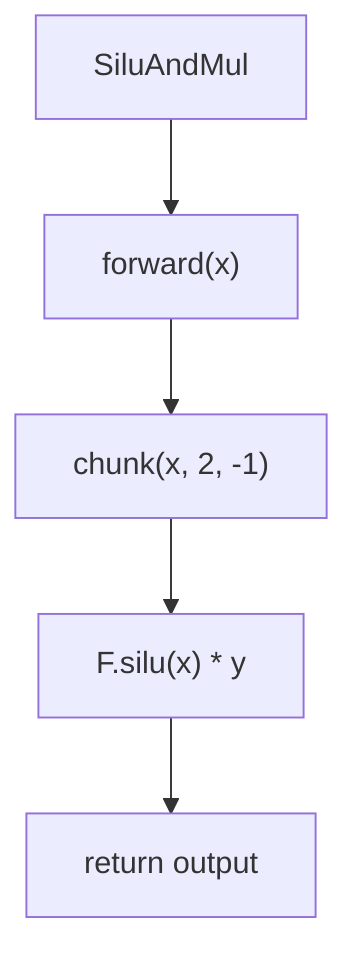
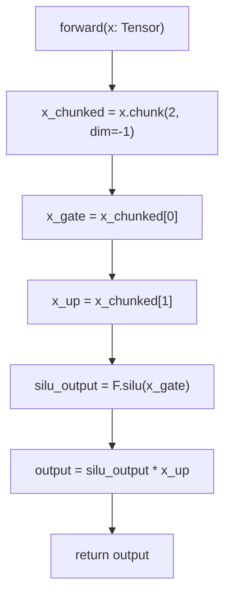
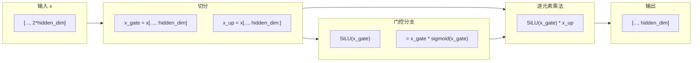
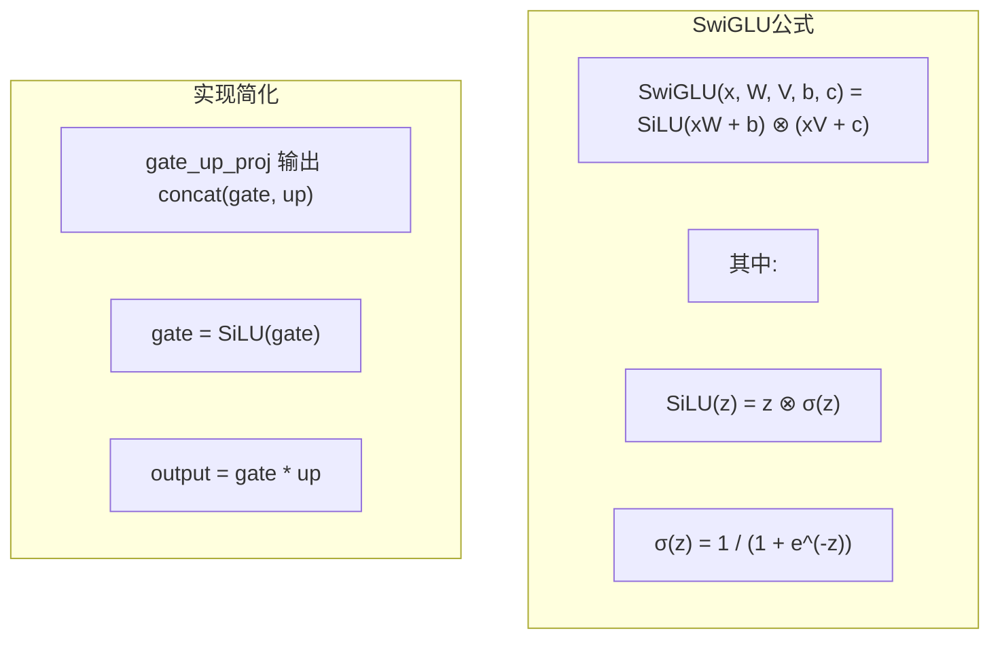
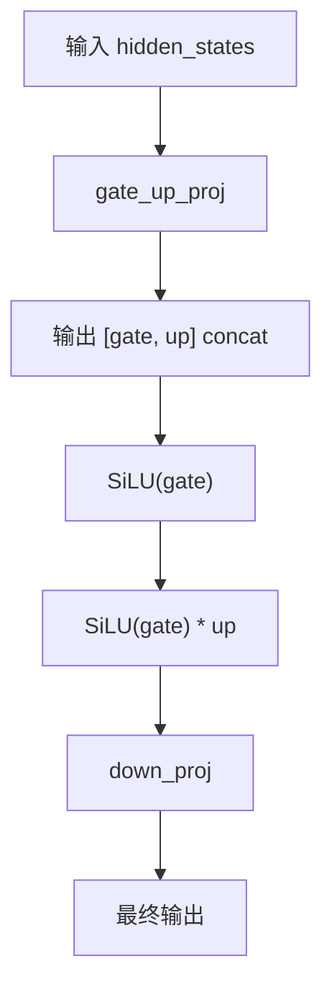
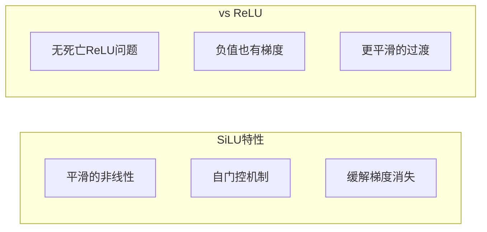

# Activation 流程图

## SiluAndMul 整体架构

```mermaid
flowchart TD
    A["SiluAndMul"] --> B["forward(x)"]
    B --> C["chunk(x, 2, -1)"]
    C --> D["F.silu(x) * y"]
    D --> E["return output"]
```

## 前向传播流程

```mermaid
flowchart TD
    A["forward(x: Tensor)"] --> B["x_chunked = x.chunk(2, dim=-1)"]
    B --> C["x_gate = x_chunked[0]"]
    C --> D["x_up = x_chunked[1]"]
    D --> E["silu_output = F.silu(x_gate)"]
    E --> F["output = silu_output * x_up"]
    F --> G["return output"]
```

## SwiGLU激活函数结构

```mermaid
flowchart LR
    subgraph Input["输入 x"]
        A["[..., 2*hidden_dim]"]
    end
    
    subgraph Split["切分"]
        B["x_gate = x[..., :hidden_dim]"]
        C["x_up = x[..., hidden_dim:]"]
    end
    
    subgraph Gate["门控分支"]
        D["SiLU(x_gate)"]
        E["= x_gate * sigmoid(x_gate)"]
    end
    
    subgraph Multiply["逐元素乘法"]
        F["SiLU(x_gate) * x_up"]
    end
    
    subgraph Output["输出"]
        G["[..., hidden_dim]"]
    end
    
    Input --> Split
    Split --> Gate
    Split --> Multiply
    Gate --> Multiply
    Multiply --> Output
```

## 数学公式

```mermaid
flowchart TD
    subgraph Formula["SwiGLU公式"]
        A["SwiGLU(x, W, V, b, c) = SiLU(xW + b) ⊗ (xV + c)"]
        B["其中:"]
        C["SiLU(z) = z ⊗ σ(z)"]
        D["σ(z) = 1 / (1 + e^(-z))"]
    end
    
    subgraph Implementation["实现简化"]
        E["gate_up_proj 输出 concat(gate, up)"]
        F["gate = SiLU(gate)"]
        G["output = gate * up"]
    end
```

## 在MLP中的应用

```mermaid
flowchart TD
    A["输入 hidden_states"] --> B["gate_up_proj"]
    B --> C["输出 [gate, up] concat"]
    C --> D["SiLU(gate)"]
    D --> E["SiLU(gate) * up"]
    E --> F["down_proj"]
    F --> G["最终输出"]
```

## 为什么使用SiLU

```mermaid
flowchart LR
    subgraph SiLU["SiLU特性"]
        A1["平滑的非线性"]
        A2["自门控机制"]
        A3["缓解梯度消失"]
    end
    
    subgraph vsReLU["vs ReLU"]
        B1["无死亡ReLU问题"]
        B2["负值也有梯度"]
        B3["更平滑的过渡"]
    end
```
