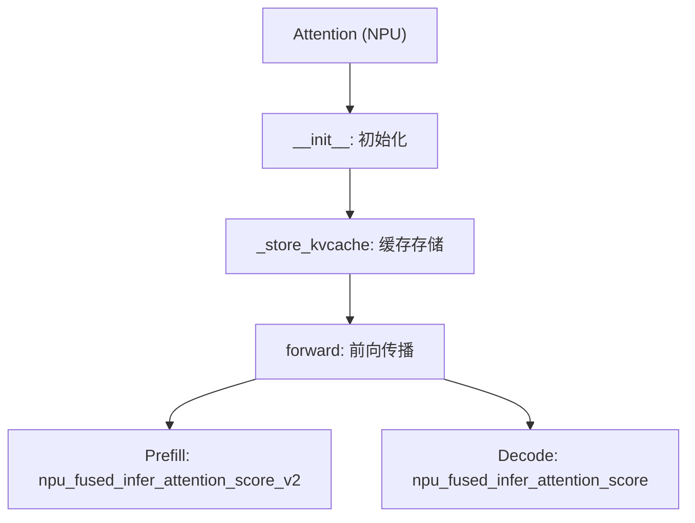
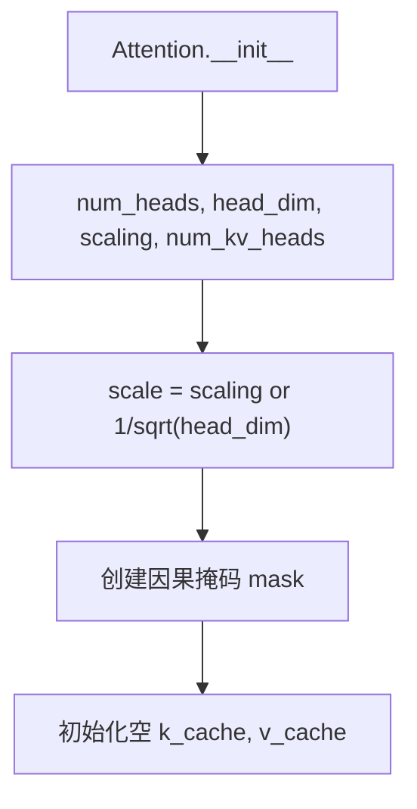
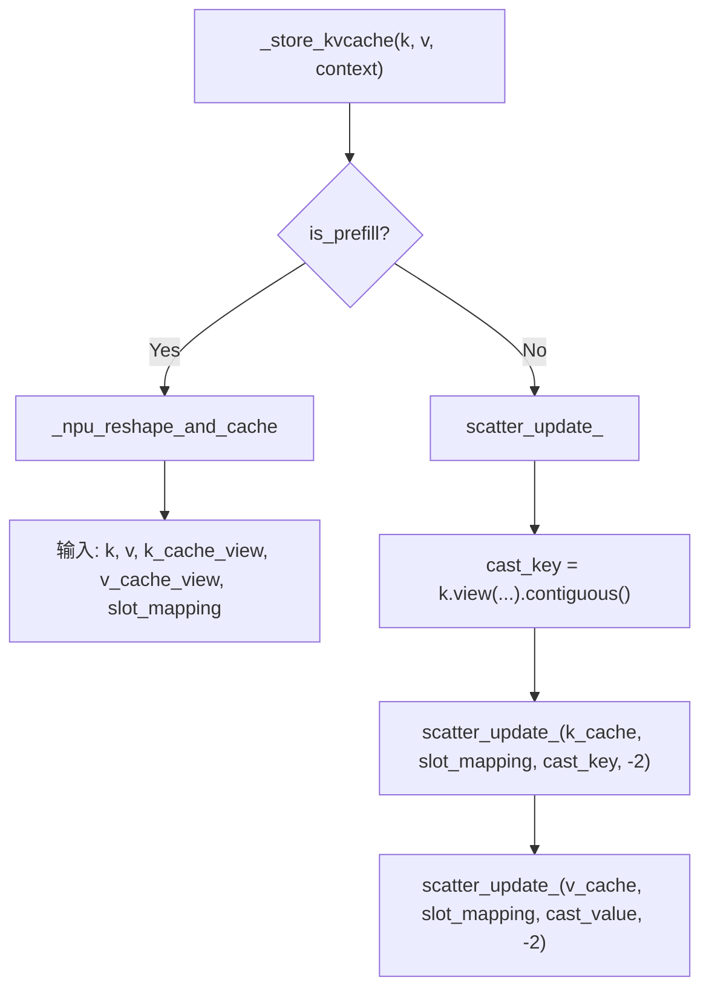
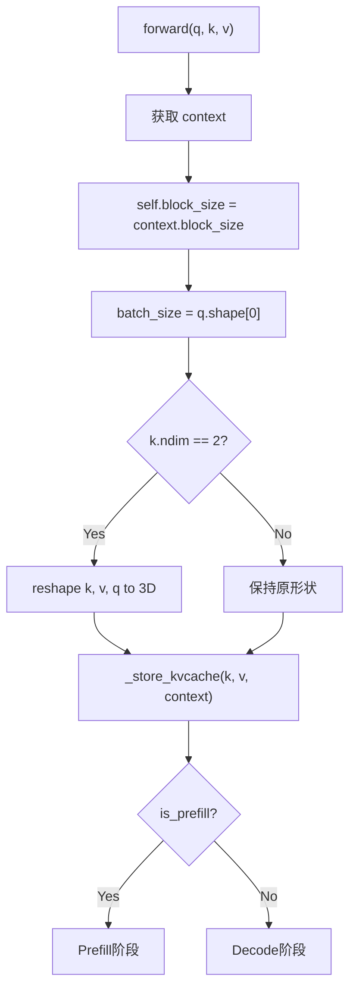
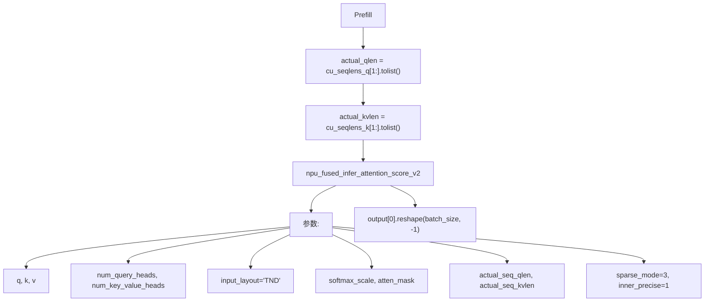
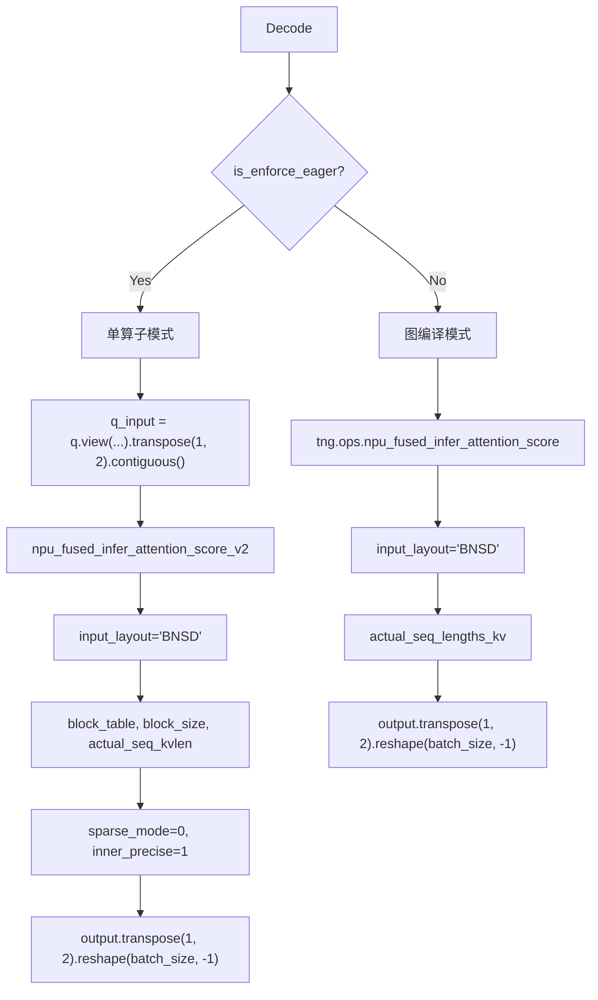
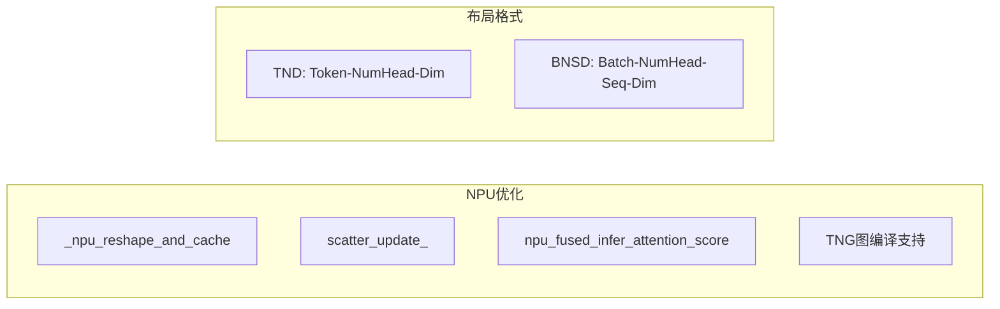

# Attention (NPU) 流程图

## 整体架构

```mermaid
flowchart TD
    A["Attention (NPU)"] --> B["__init__: 初始化"]
    B --> C["_store_kvcache: 缓存存储"]
    C --> D["forward: 前向传播"]
    D --> E["Prefill: npu_fused_infer_attention_score_v2"]
    D --> F["Decode: npu_fused_infer_attention_score"]
```

## 初始化流程

```mermaid
flowchart TD
    A["Attention.__init__"] --> B["num_heads, head_dim, scaling, num_kv_heads"]
    B --> C["scale = scaling or 1/sqrt(head_dim)"]
    C --> D["创建因果掩码 mask"]
    D --> E["初始化空 k_cache, v_cache"]
```

## KV缓存存储

```mermaid
flowchart TD
    A["_store_kvcache(k, v, context)"] --> B{"is_prefill?"}
    B -->|Yes| C["_npu_reshape_and_cache"]
    B -->|No| D["scatter_update_"]
    
    C --> E["输入: k, v, k_cache_view, v_cache_view, slot_mapping"]
    D --> F["cast_key = k.view(...).contiguous()"]
    F --> G["scatter_update_(k_cache, slot_mapping, cast_key, -2)"]
    G --> H["scatter_update_(v_cache, slot_mapping, cast_value, -2)"]
```

## 主前向传播流程

```mermaid
flowchart TD
    A["forward(q, k, v)"] --> B["获取 context"]
    B --> C["self.block_size = context.block_size"]
    C --> D["batch_size = q.shape[0]"]
    D --> E{"k.ndim == 2?"}
    E -->|Yes| F["reshape k, v, q to 3D"]
    E -->|No| G["保持原形状"]
    F --> H["_store_kvcache(k, v, context)"]
    G --> H
    H --> I{"is_prefill?"}
    I -->|Yes| J["Prefill阶段"]
    I -->|No| K["Decode阶段"]
```

## Prefill阶段

```mermaid
flowchart TD
    A["Prefill"] --> B["actual_qlen = cu_seqlens_q[1:].tolist()"]
    B --> C["actual_kvlen = cu_seqlens_k[1:].tolist()"]
    C --> D["npu_fused_infer_attention_score_v2"]
    D --> E["参数:"]
    E --> E1["q, k, v"]
    E --> E2["num_query_heads, num_key_value_heads"]
    E --> E3["input_layout='TND'"]
    E --> E4["softmax_scale, atten_mask"]
    E --> E5["actual_seq_qlen, actual_seq_kvlen"]
    E --> E6["sparse_mode=3, inner_precise=1"]
    D --> F["output[0].reshape(batch_size, -1)"]
```

## Decode阶段

```mermaid
flowchart TD
    A["Decode"] --> B{"is_enforce_eager?"}
    B -->|Yes| C["单算子模式"]
    B -->|No| D["图编译模式"]
    
    C --> E["q_input = q.view(...).transpose(1, 2).contiguous()"]
    E --> F["npu_fused_infer_attention_score_v2"]
    F --> G["input_layout='BNSD'"]
    G --> H["block_table, block_size, actual_seq_kvlen"]
    H --> I["sparse_mode=0, inner_precise=1"]
    I --> J["output.transpose(1, 2).reshape(batch_size, -1)"]
    
    D --> K["tng.ops.npu_fused_infer_attention_score"]
    K --> L["input_layout='BNSD'"]
    L --> M["actual_seq_lengths_kv"]
    M --> N["output.transpose(1, 2).reshape(batch_size, -1)"]
```

## NPU特定优化

```mermaid
flowchart LR
    subgraph Optimizations["NPU优化"]
        A1["_npu_reshape_and_cache"]
        A2["scatter_update_"]
        A3["npu_fused_infer_attention_score"]
        A4["TNG图编译支持"]
    end
    
    subgraph Layouts["布局格式"]
        B1["TND: Token-NumHead-Dim"]
        B2["BNSD: Batch-NumHead-Seq-Dim"]
    end
```
