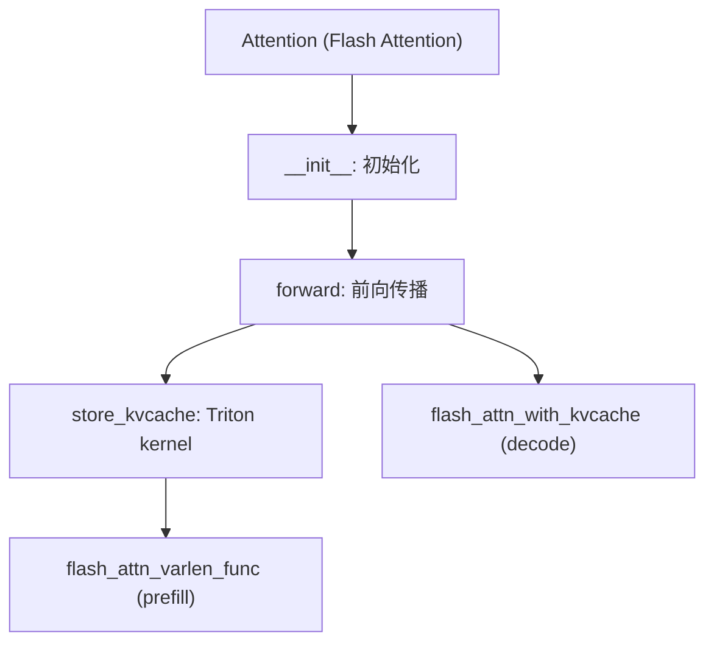
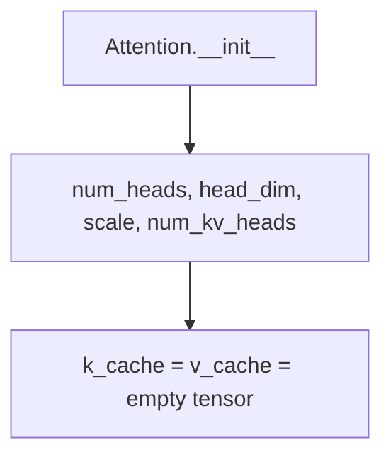
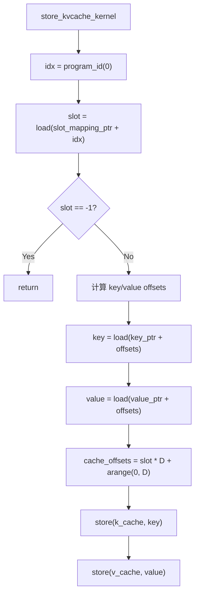
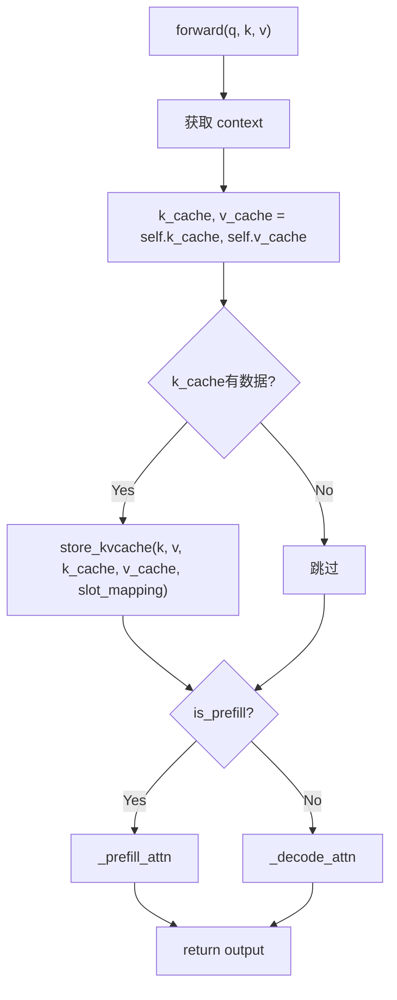
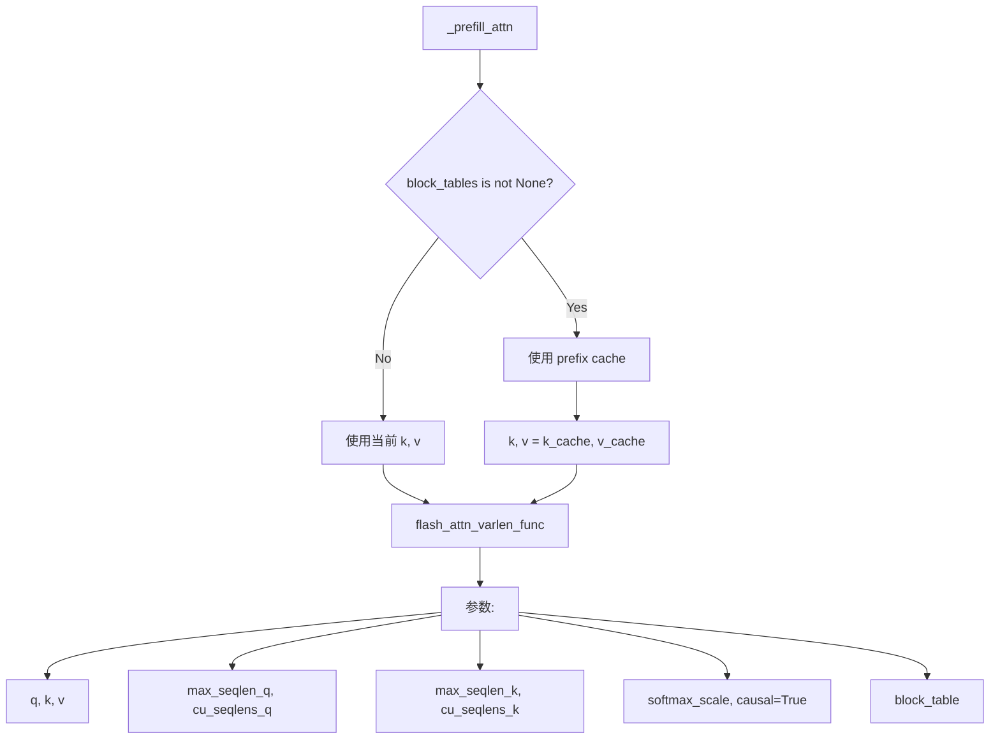
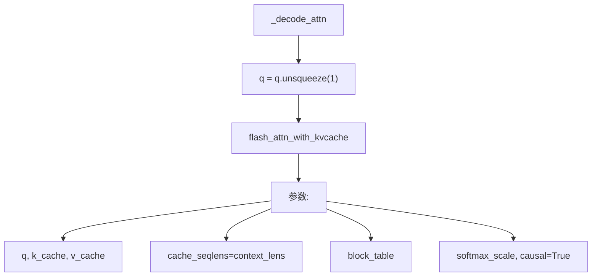
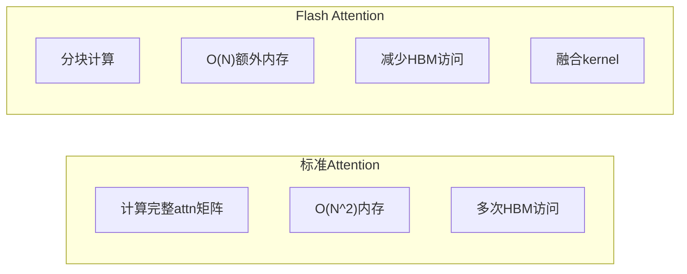

# Attention (Flash Attention) 流程图

## 整体架构

```mermaid
flowchart TD
    A["Attention (Flash Attention)"] --> B["__init__: 初始化"]
    B --> C["forward: 前向传播"]
    C --> D["store_kvcache: Triton kernel"]
    D --> E["flash_attn_varlen_func (prefill)"]
    C --> F["flash_attn_with_kvcache (decode)"]
```

## 初始化流程

```mermaid
flowchart TD
    A["Attention.__init__"] --> B["num_heads, head_dim, scale, num_kv_heads"]
    B --> C["k_cache = v_cache = empty tensor"]
```

## Triton Kernel (store_kvcache)

```mermaid
flowchart TD
    A["store_kvcache_kernel"] --> B["idx = program_id(0)"]
    B --> C["slot = load(slot_mapping_ptr + idx)"]
    C --> D{"slot == -1?"}
    D -->|Yes| E["return"]
    D -->|No| F["计算 key/value offsets"]
    F --> G["key = load(key_ptr + offsets)"]
    G --> H["value = load(value_ptr + offsets)"]
    H --> I["cache_offsets = slot * D + arange(0, D)"]
    I --> J["store(k_cache, key)"]
    J --> K["store(v_cache, value)"]
```

## 主前向传播流程

```mermaid
flowchart TD
    A["forward(q, k, v)"] --> B["获取 context"]
    B --> C["k_cache, v_cache = self.k_cache, self.v_cache"]
    C --> D{"k_cache有数据?"}
    D -->|Yes| E["store_kvcache(k, v, k_cache, v_cache, slot_mapping)"]
    D -->|No| F["跳过"]
    E --> G{"is_prefill?"}
    F --> G
    G -->|Yes| H["_prefill_attn"]
    G -->|No| I["_decode_attn"]
    H --> J["return output"]
    I --> J
```

## Prefill阶段

```mermaid
flowchart TD
    A["_prefill_attn"] --> B{"block_tables is not None?"}
    B -->|Yes| C["使用 prefix cache"]
    B -->|No| D["使用当前 k, v"]
    C --> E["k, v = k_cache, v_cache"]
    D --> F
    E --> F
    F["flash_attn_varlen_func"] --> G["参数:"]
    G --> G1["q, k, v"]
    G --> G2["max_seqlen_q, cu_seqlens_q"]
    G --> G3["max_seqlen_k, cu_seqlens_k"]
    G --> G4["softmax_scale, causal=True"]
    G --> G5["block_table"]
```

## Decode阶段

```mermaid
flowchart TD
    A["_decode_attn"] --> B["q = q.unsqueeze(1)"]
    B --> C["flash_attn_with_kvcache"]
    C --> D["参数:"]
    D --> D1["q, k_cache, v_cache"]
    D --> D2["cache_seqlens=context_lens"]
    D --> D3["block_table"]
    D --> D4["softmax_scale, causal=True"]
```

## Flash Attention优势

```mermaid
flowchart LR
    subgraph Standard["标准Attention"]
        A1["计算完整attn矩阵"]
        A2["O(N^2)内存"]
        A3["多次HBM访问"]
    end
    
    subgraph Flash["Flash Attention"]
        B1["分块计算"]
        B2["O(N)额外内存"]
        B3["减少HBM访问"]
        B4["融合kernel"]
    end
```
