# Attention Torch Native 流程图

## 整体架构

### 类结构概览

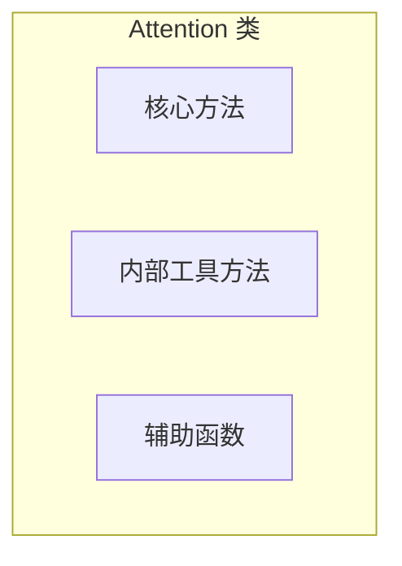

### 核心方法

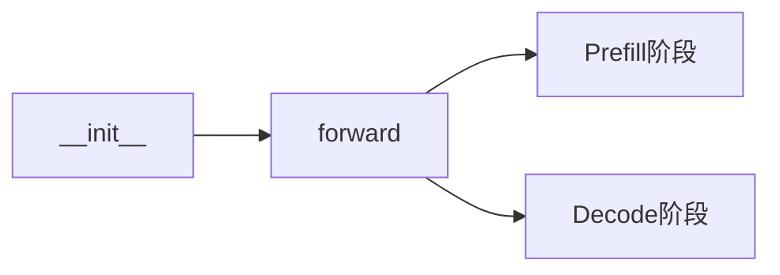

### 内部方法分类

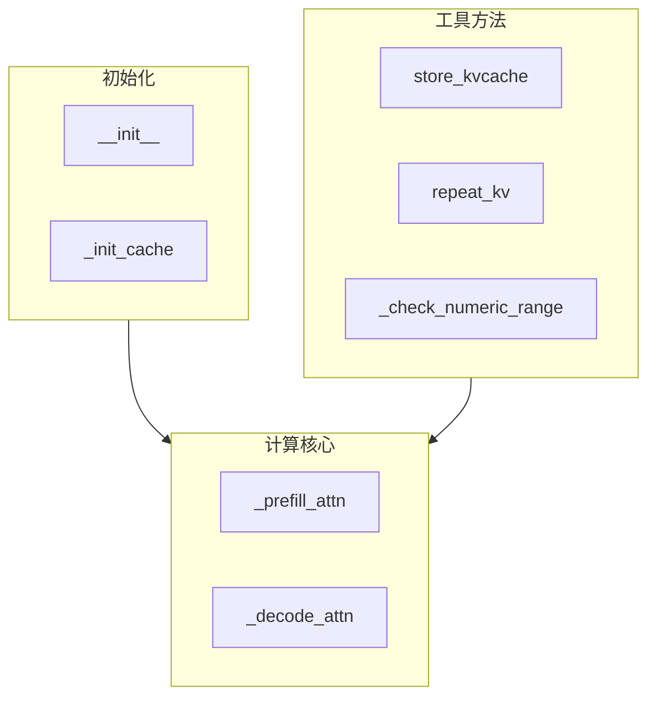

## 初始化流程

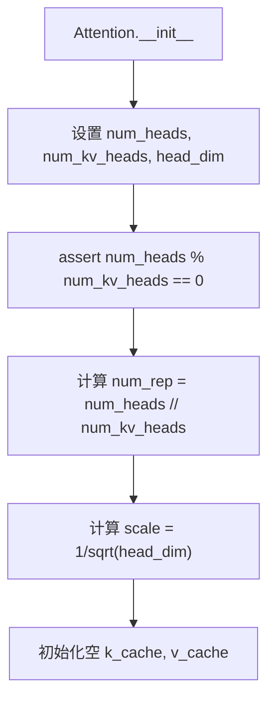

## KV缓存存储流程

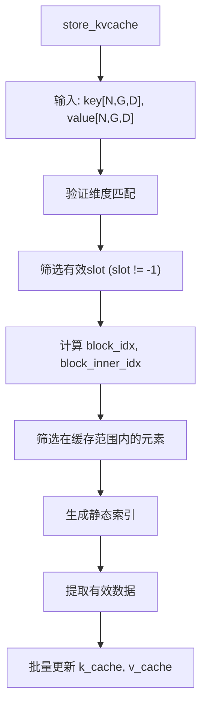

## GQA扩展 (repeat_kv)

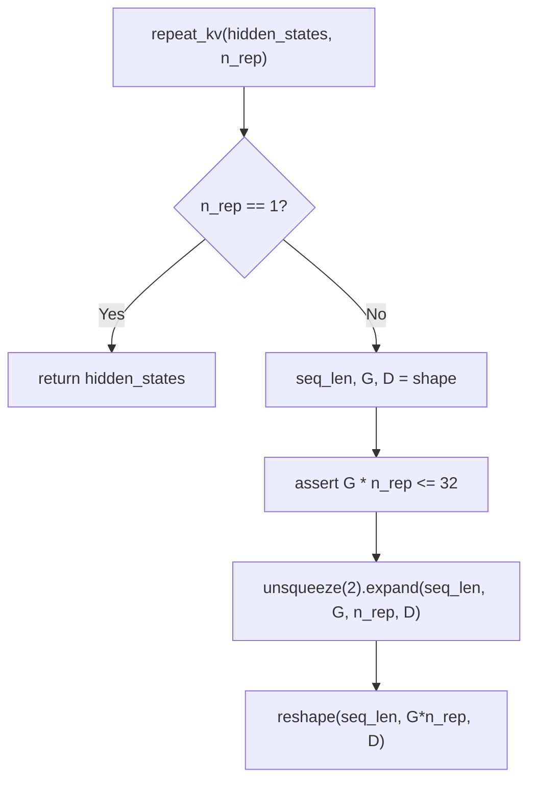

## Prefill注意力计算

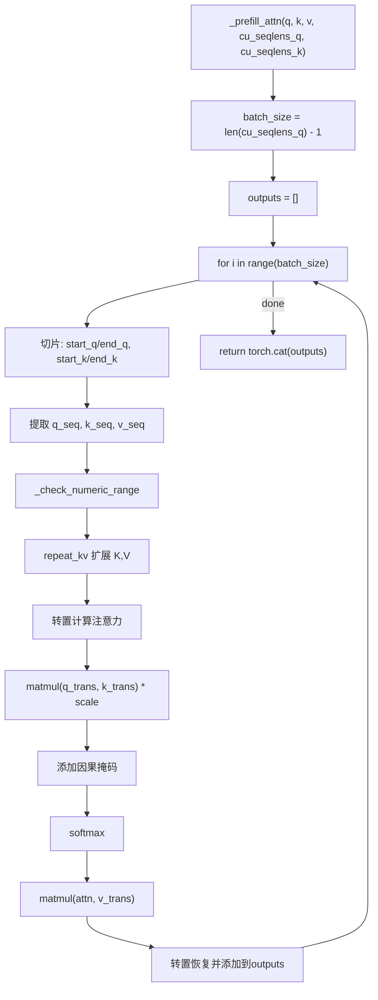

## Decode注意力计算

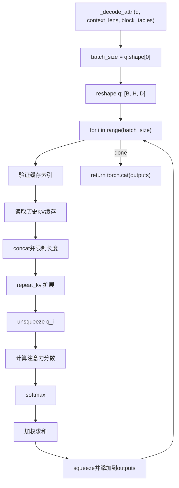

## 主前向传播流程

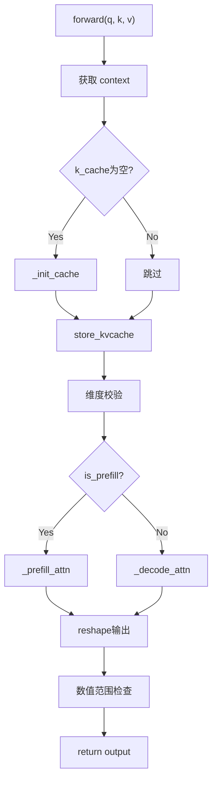

## Prefill vs Decode 对比

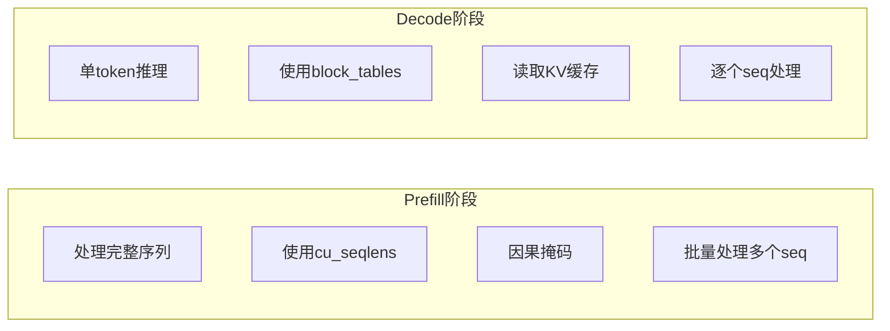

## 数值范围检查

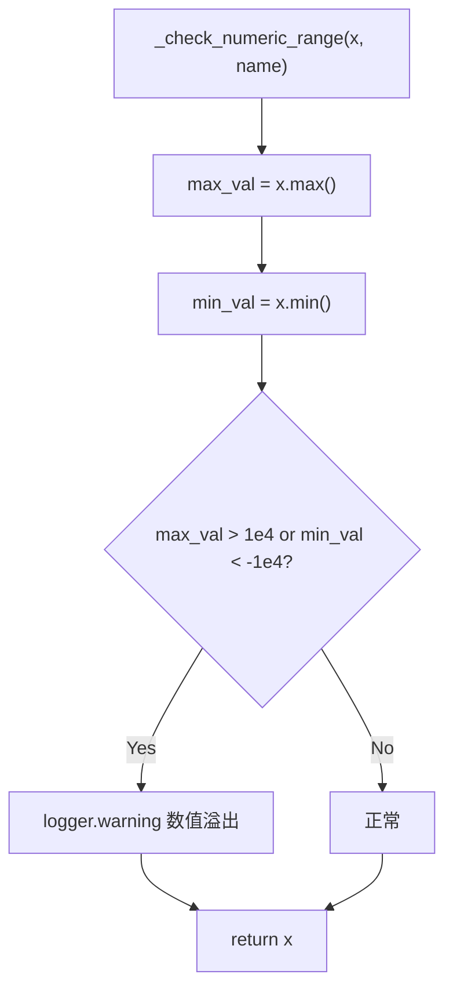

## 因果掩码生成

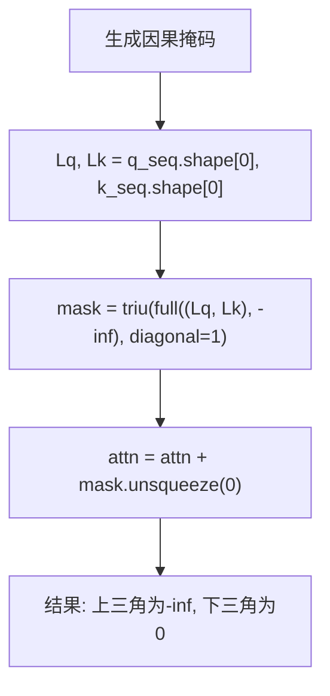
