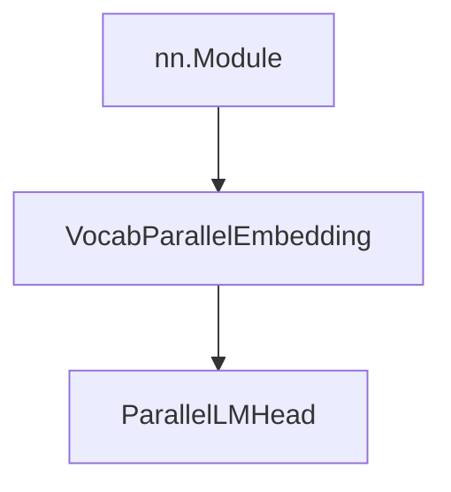
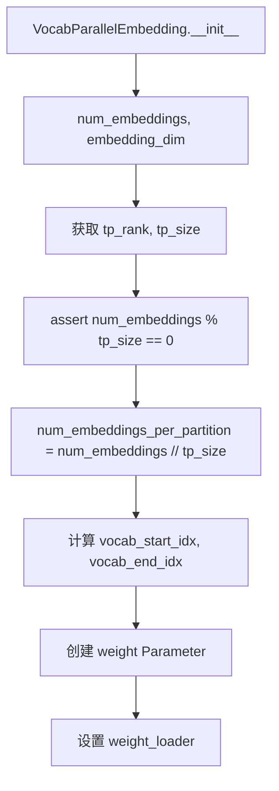
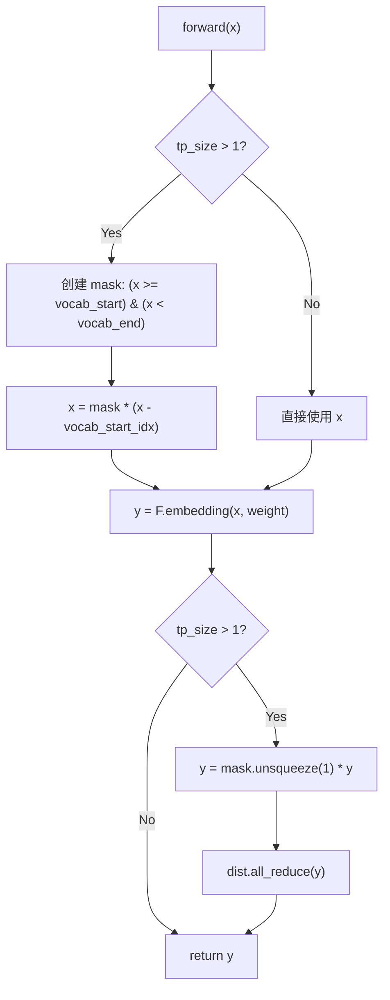
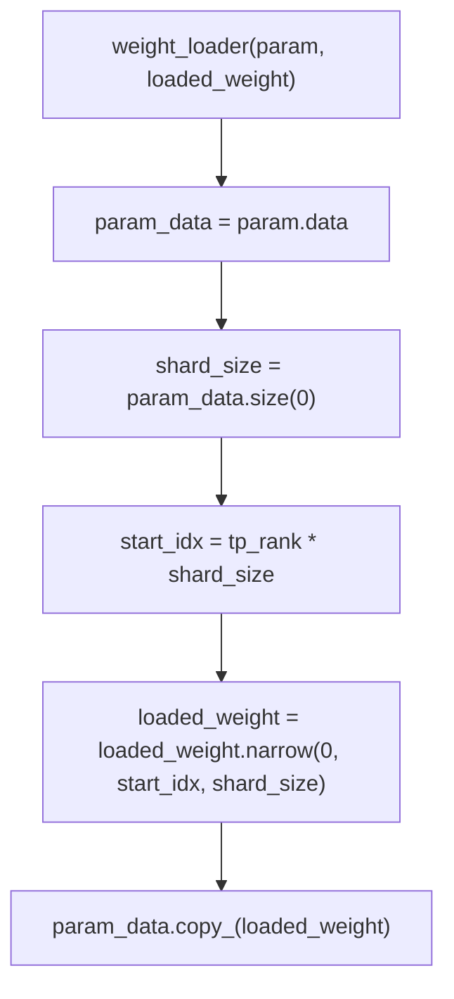
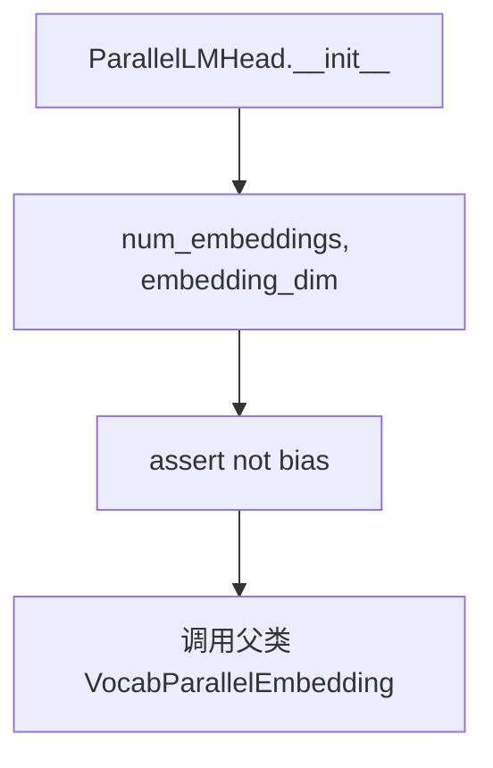
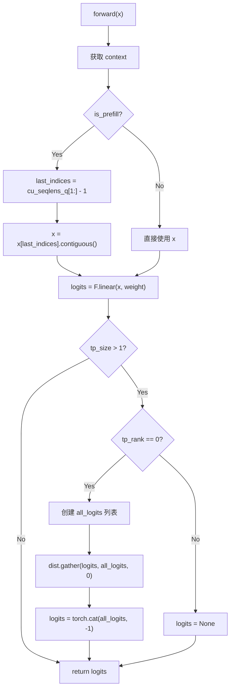
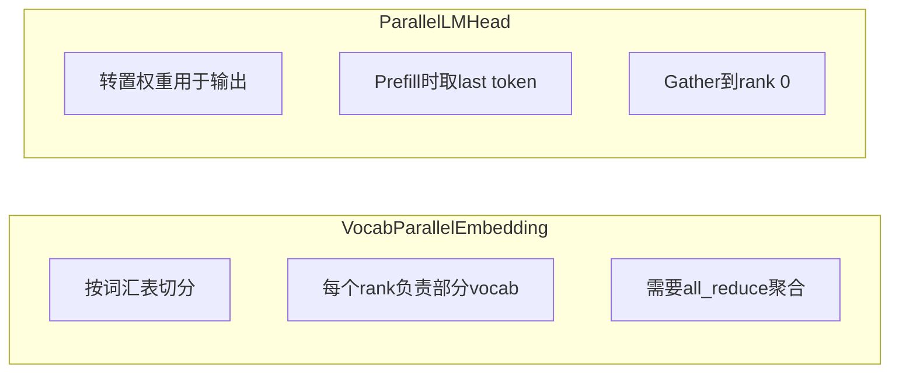
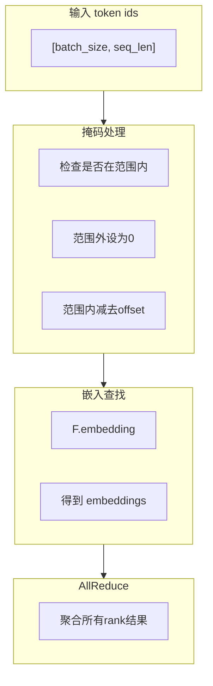
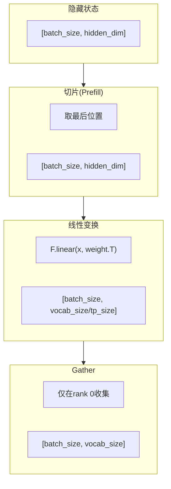

# Embed Head 流程图

## 整体架构

## VocabParallelEmbedding

## VocabParallelEmbedding 前向传播

## VocabParallelEmbedding 权重加载

## ParallelLMHead

## ParallelLMHead 前向传播

## 词嵌入并行策略

## 输入处理流程

## 输出投影流程

