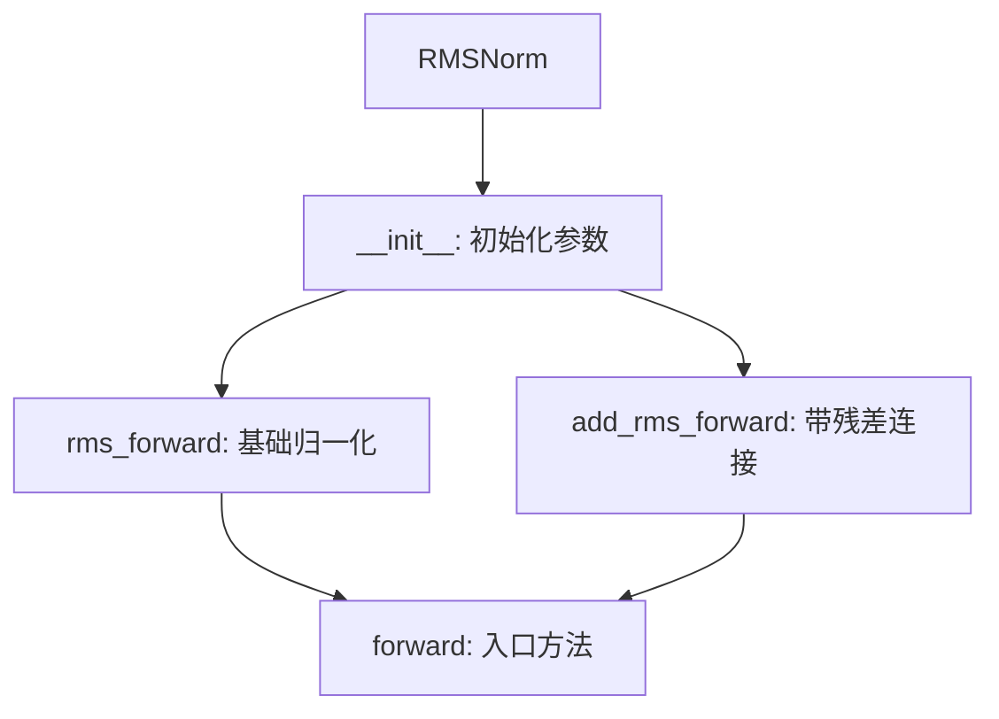
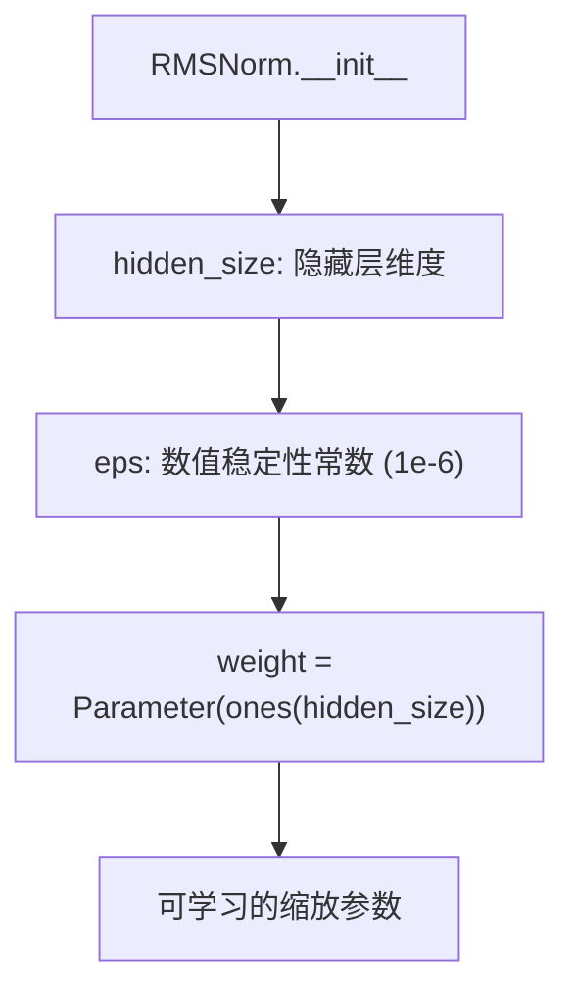
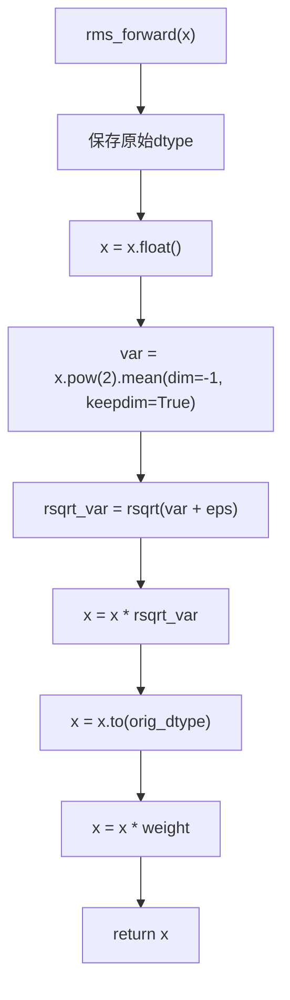
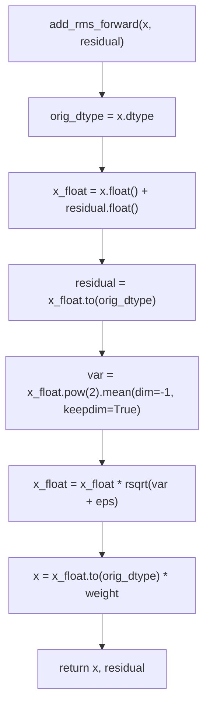
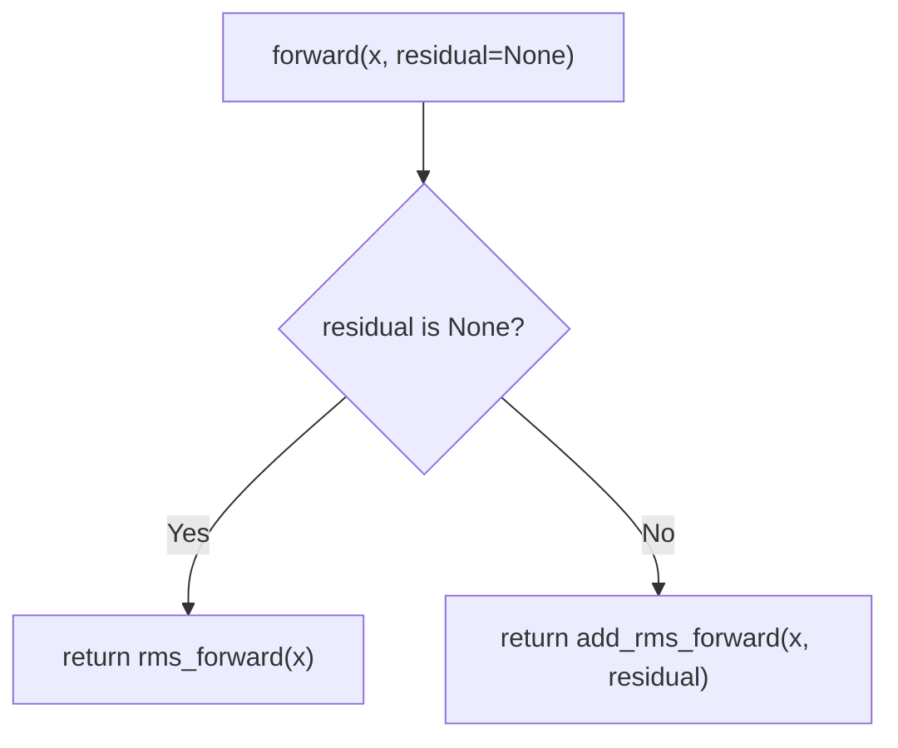
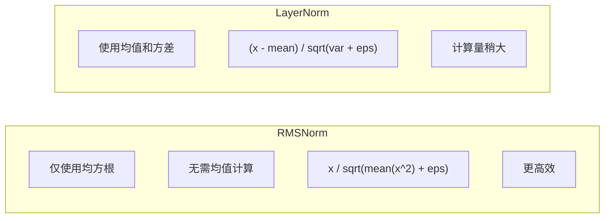
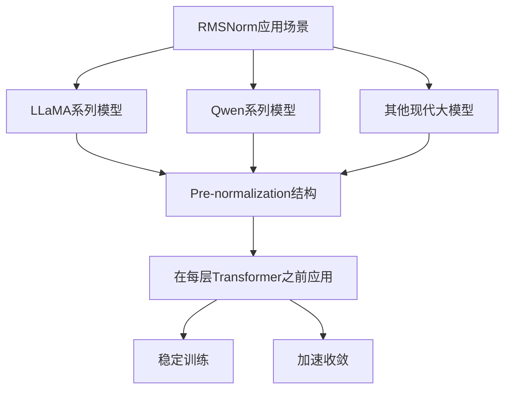

# RMSNorm 流程图

## RMSNorm 整体架构

```mermaid
flowchart TD
    A["RMSNorm"] --> B["__init__: 初始化参数"]
    B --> C["rms_forward: 基础归一化"]
    B --> D["add_rms_forward: 带残差连接"]
    C --> E["forward: 入口方法"]
    D --> E
```

## 初始化流程

```mermaid
flowchart TD
    A["RMSNorm.__init__"] --> B["hidden_size: 隐藏层维度"]
    B --> C["eps: 数值稳定性常数 (1e-6)"]
    C --> D["weight = Parameter(ones(hidden_size))"]
    D --> E["可学习的缩放参数"]
```

## 基础归一化流程

```mermaid
flowchart TD
    A["rms_forward(x)"] --> B["保存原始dtype"]
    B --> C["x = x.float()"]
    C --> D["var = x.pow(2).mean(dim=-1, keepdim=True)"]
    D --> E["rsqrt_var = rsqrt(var + eps)"]
    E --> F["x = x * rsqrt_var"]
    F --> G["x = x.to(orig_dtype)"]
    G --> H["x = x * weight"]
    H --> I["return x"]
```

## 带残差连接的归一化

```mermaid
flowchart TD
    A["add_rms_forward(x, residual)"] --> B["orig_dtype = x.dtype"]
    B --> C["x_float = x.float() + residual.float()"]
    C --> D["residual = x_float.to(orig_dtype)"]
    D --> E["var = x_float.pow(2).mean(dim=-1, keepdim=True)"]
    E --> F["x_float = x_float * rsqrt(var + eps)"]
    F --> G["x = x_float.to(orig_dtype) * weight"]
    G --> H["return x, residual"]
```

## 主入口方法

```mermaid
flowchart TD
    A["forward(x, residual=None)"] --> B{"residual is None?"}
    B -->|Yes| C["return rms_forward(x)"]
    B -->|No| D["return add_rms_forward(x, residual)"]
```

## RMSNorm vs LayerNorm

```mermaid
flowchart LR
    subgraph RMSNorm["RMSNorm"]
        A1["仅使用均方根"]
        A2["无需均值计算"]
        A3["x / sqrt(mean(x^2) + eps)"]
        A4["更高效"]
    end
    
    subgraph LayerNorm["LayerNorm"]
        B1["使用均值和方差"]
        B2["(x - mean) / sqrt(var + eps)"]
        B3["计算量稍大"]
    end
```

## 计算流程对比

```mermaid
flowchart TD
    subgraph RMSNormCalc["RMSNorm计算"]
        A["Input: x"]
        B["mean_square = mean(x^2)"]
        C["rms = sqrt(mean_square + eps)"]
        D["norm_x = x / rms"]
        E["output = norm_x * weight"]
        A --> B --> C --> D --> E
    end
    
    subgraph LayerNormCalc["LayerNorm计算"]
        F["Input: x"]
        G["mean = mean(x)"]
        H["var = mean((x-mean)^2)"]
        I["std = sqrt(var + eps)"]
        J["norm_x = (x - mean) / std"]
        K["output = norm_x * weight + bias"]
        F --> G --> H --> I --> J --> K
    end
```

## 使用场景

```mermaid
flowchart TD
    A["RMSNorm应用场景"] --> B["LLaMA系列模型"]
    A --> C["Qwen系列模型"]
    A --> D["其他现代大模型"]
    
    B --> E["Pre-normalization结构"]
    C --> E
    D --> E
    
    E --> F["在每层Transformer之前应用"]
    F --> G["稳定训练"]
    F --> H["加速收敛"]
```
