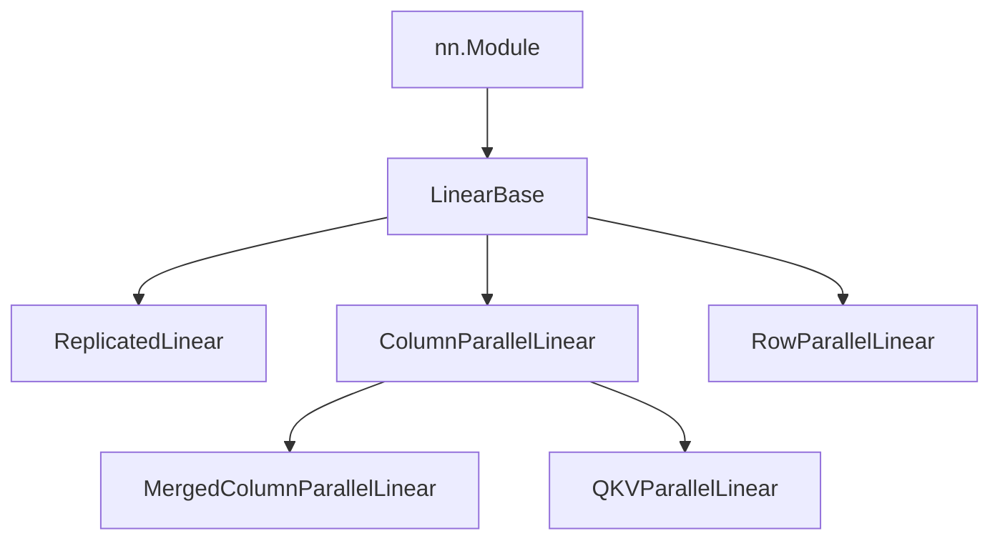
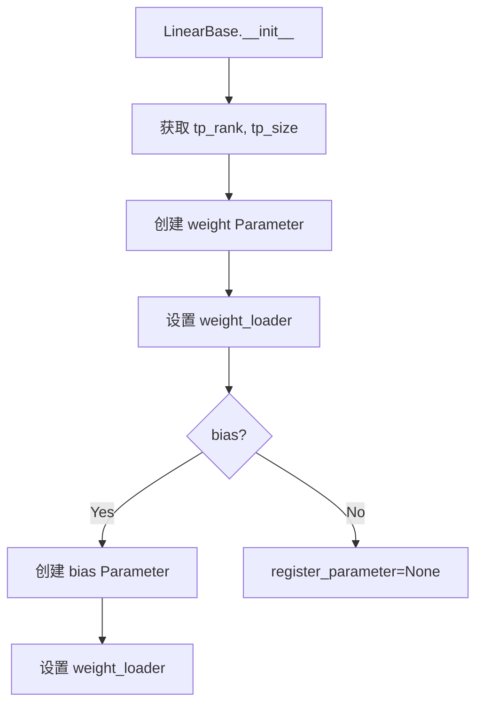
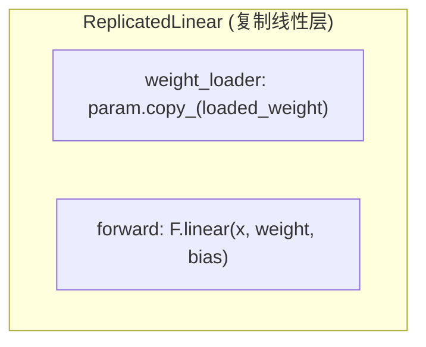
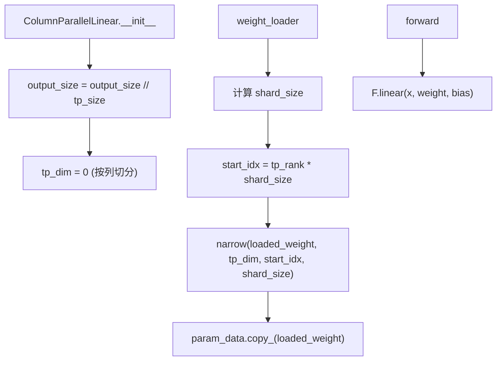
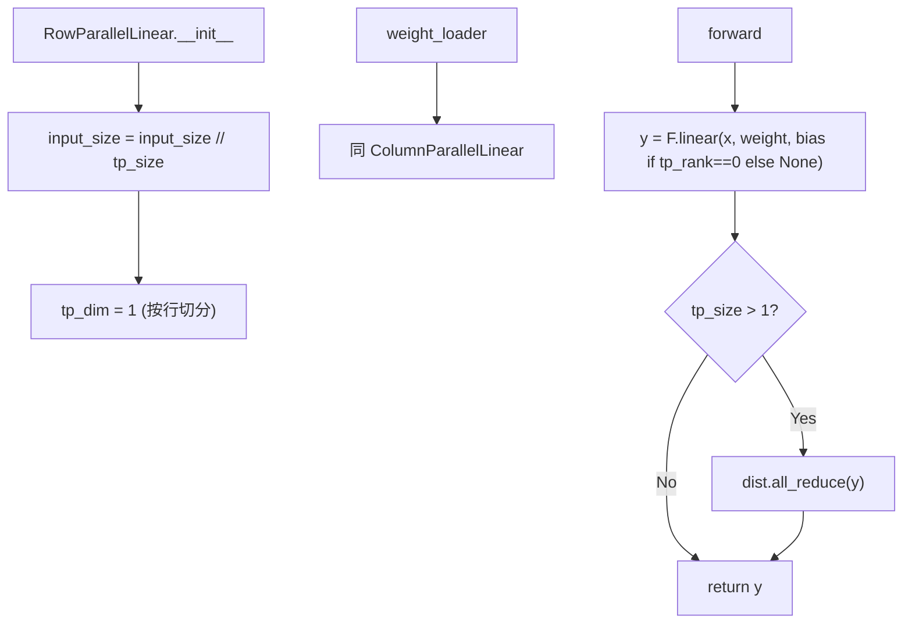
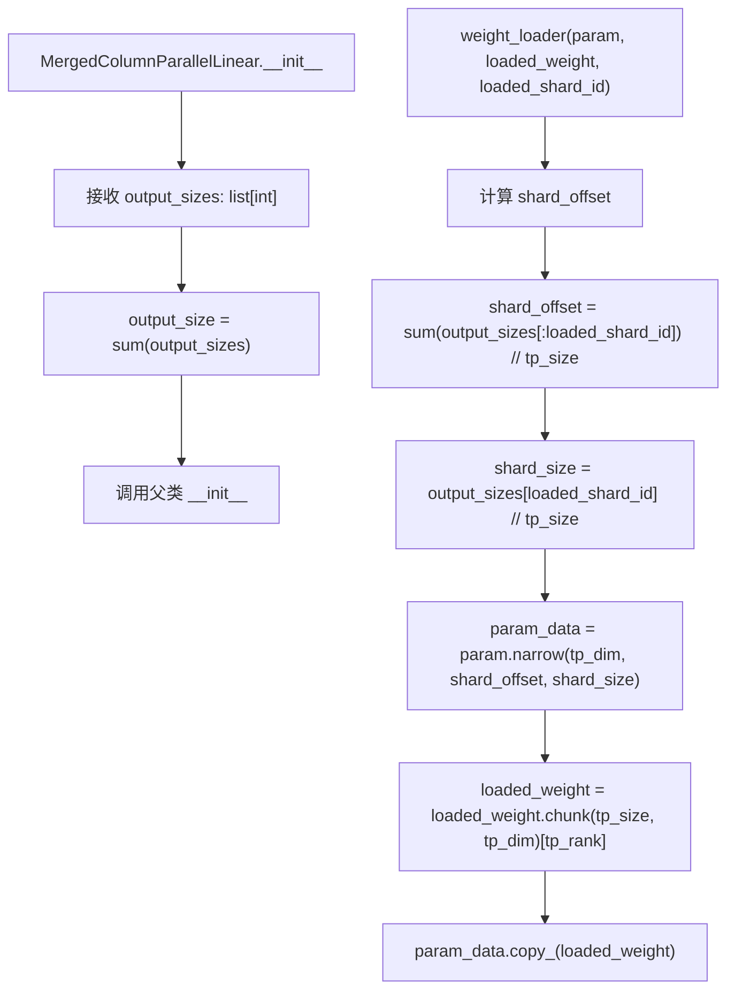
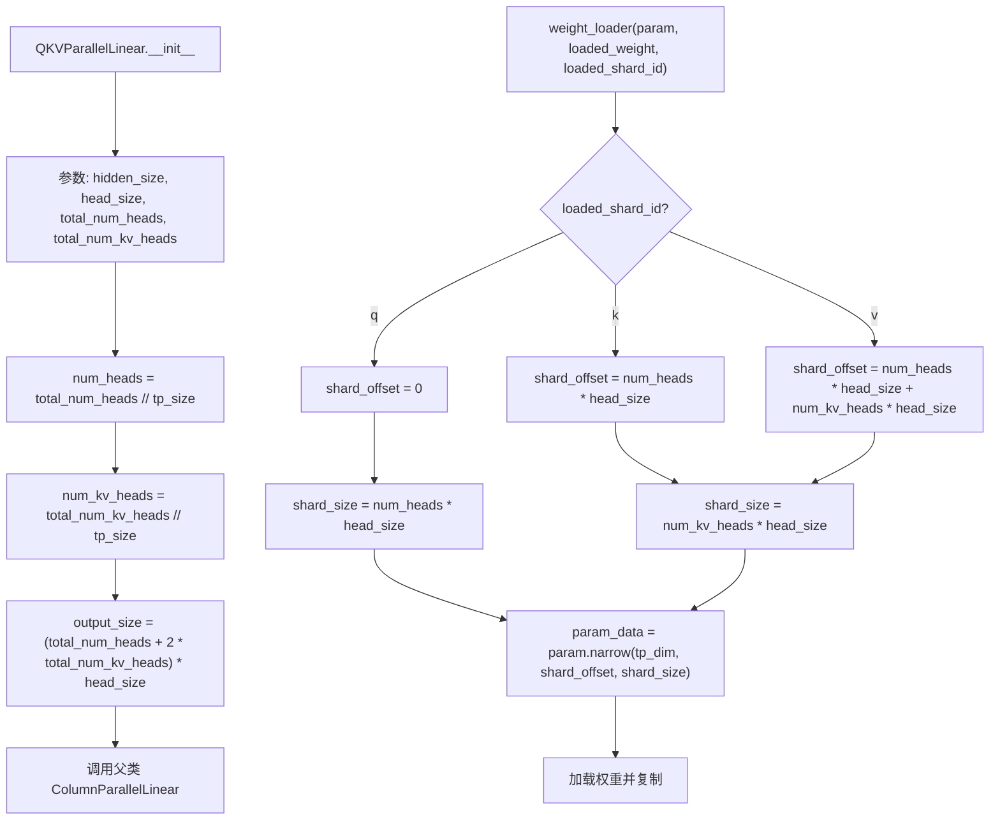
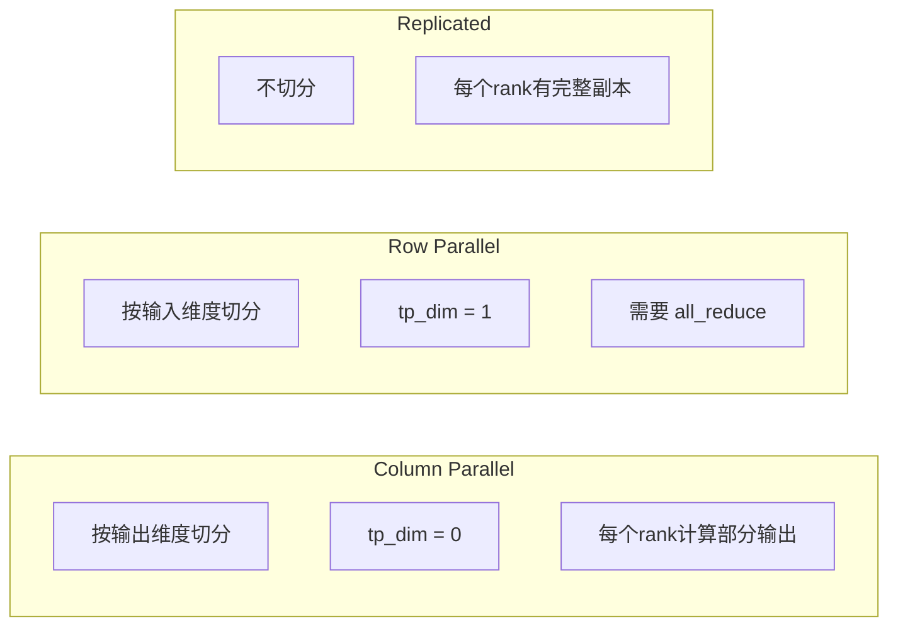
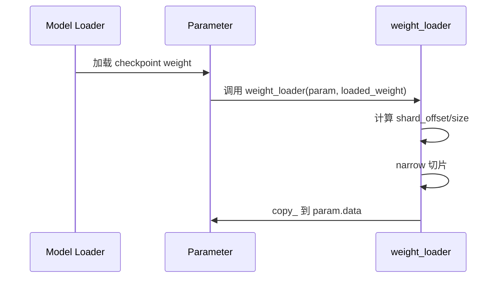

# Linear Layers 流程图

## 类继承关系

## LinearBase 初始化流程

## ReplicatedLinear

## ColumnParallelLinear

## RowParallelLinear

## MergedColumnParallelLinear

## QKVParallelLinear

## 张量并行策略对比

## 权重加载流程

