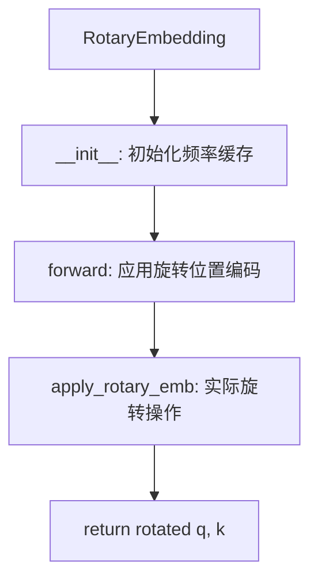
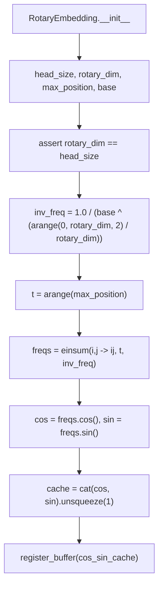
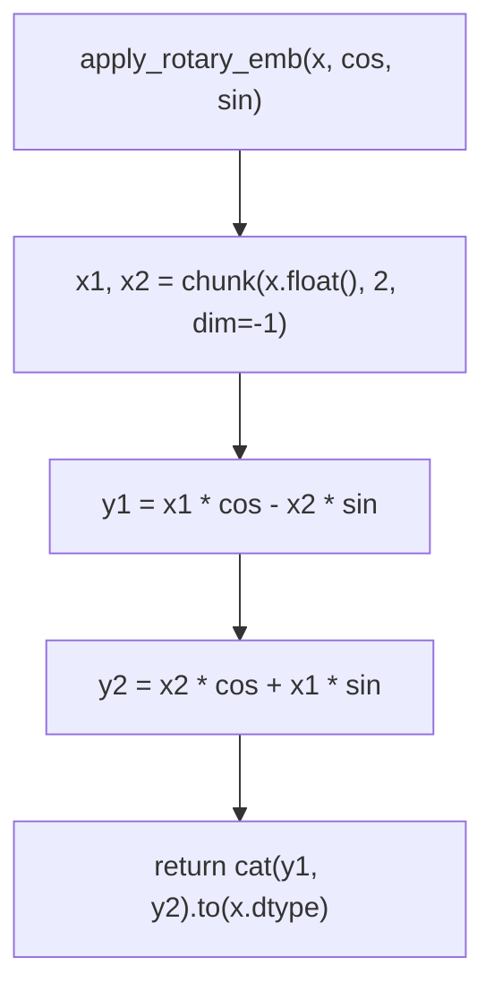
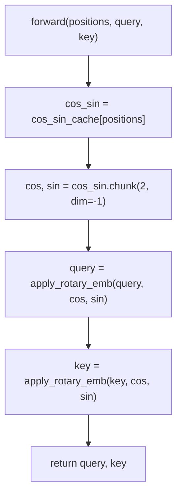
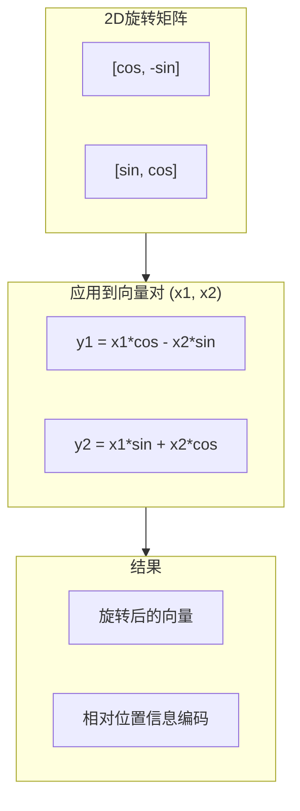
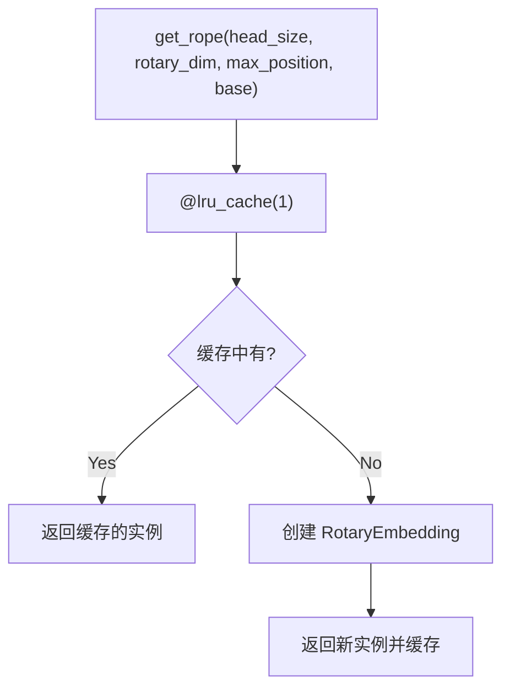
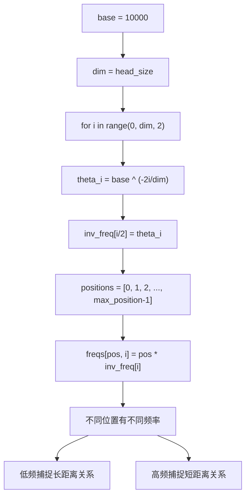
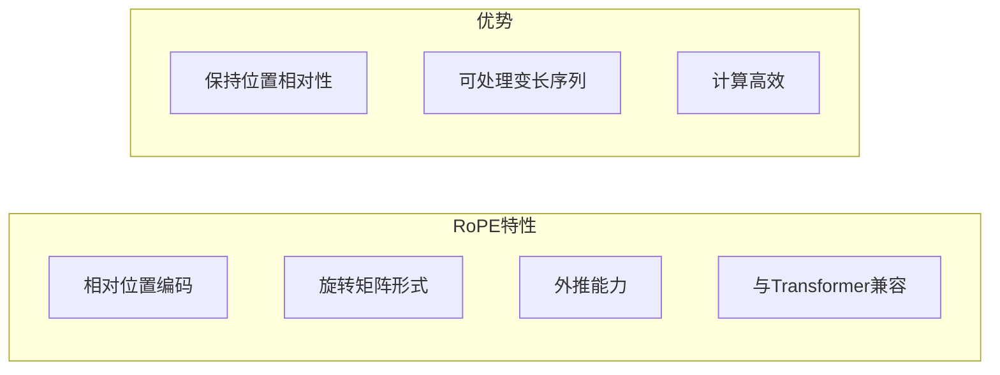

# Rotary Embedding 流程图

## RoPE 整体架构

```mermaid
flowchart TD
    A["RotaryEmbedding"] --> B["__init__: 初始化频率缓存"]
    B --> C["forward: 应用旋转位置编码"]
    C --> D["apply_rotary_emb: 实际旋转操作"]
    D --> E["return rotated q, k"]
```

## 初始化流程

```mermaid
flowchart TD
    A["RotaryEmbedding.__init__"] --> B["head_size, rotary_dim, max_position, base"]
    B --> C["assert rotary_dim == head_size"]
    C --> D["inv_freq = 1.0 / (base ^ (arange(0, rotary_dim, 2) / rotary_dim))"]
    D --> E["t = arange(max_position)"]
    E --> F["freqs = einsum(i,j -> ij, t, inv_freq)"]
    F --> G["cos = freqs.cos(), sin = freqs.sin()"]
    G --> H["cache = cat(cos, sin).unsqueeze(1)"]
    H --> I["register_buffer(cos_sin_cache)"]
```

## 应用旋转位置编码

```mermaid
flowchart TD
    A["apply_rotary_emb(x, cos, sin)"] --> B["x1, x2 = chunk(x.float(), 2, dim=-1)"]
    B --> C["y1 = x1 * cos - x2 * sin"]
    C --> D["y2 = x2 * cos + x1 * sin"]
    D --> E["return cat(y1, y2).to(x.dtype)"]
```

## 前向传播流程

```mermaid
flowchart TD
    A["forward(positions, query, key)"] --> B["cos_sin = cos_sin_cache[positions]"]
    B --> C["cos, sin = cos_sin.chunk(2, dim=-1)"]
    C --> D["query = apply_rotary_emb(query, cos, sin)"]
    D --> E["key = apply_rotary_emb(key, cos, sin)"]
    E --> F["return query, key"]
```

## 旋转操作数学原理

```mermaid
flowchart TD
    subgraph Rotation["2D旋转矩阵"]
        A["[cos, -sin]"]
        B["[sin,  cos]"]
    end
    
    subgraph Apply["应用到向量对 (x1, x2)"]
        C["y1 = x1*cos - x2*sin"]
        D["y2 = x1*sin + x2*cos"]
    end
    
    subgraph Result["结果"]
        E["旋转后的向量"]
        F["相对位置信息编码"]
    end
    
    Rotation --> Apply
    Apply --> Result
```

## get_rope 工厂函数

```mermaid
flowchart TD
    A["get_rope(head_size, rotary_dim, max_position, base)"] --> B["@lru_cache(1)"]
    B --> C{"缓存中有?"}
    C -->|Yes| D["返回缓存的实例"]
    C -->|No| E["创建 RotaryEmbedding"]
    E --> F["返回新实例并缓存"]
```

## 频率计算过程

```mermaid
flowchart TD
    A["base = 10000"] --> B["dim = head_size"]
    B --> C["for i in range(0, dim, 2)"]
    C --> D["theta_i = base ^ (-2i/dim)"]
    D --> E["inv_freq[i/2] = theta_i"]
    E --> F["positions = [0, 1, 2, ..., max_position-1]"]
    F --> G["freqs[pos, i] = pos * inv_freq[i]"]
    G --> H["不同位置有不同频率"]
    H --> I["低频捕捉长距离关系"]
    H --> J["高频捕捉短距离关系"]
```

## RoPE 特点

```mermaid
flowchart LR
    subgraph Features["RoPE特性"]
        A1["相对位置编码"]
        A2["旋转矩阵形式"]
        A3["外推能力"]
        A4["与Transformer兼容"]
    end
    
    subgraph Benefits["优势"]
        B1["保持位置相对性"]
        B2["可处理变长序列"]
        B3["计算高效"]
    end
```
