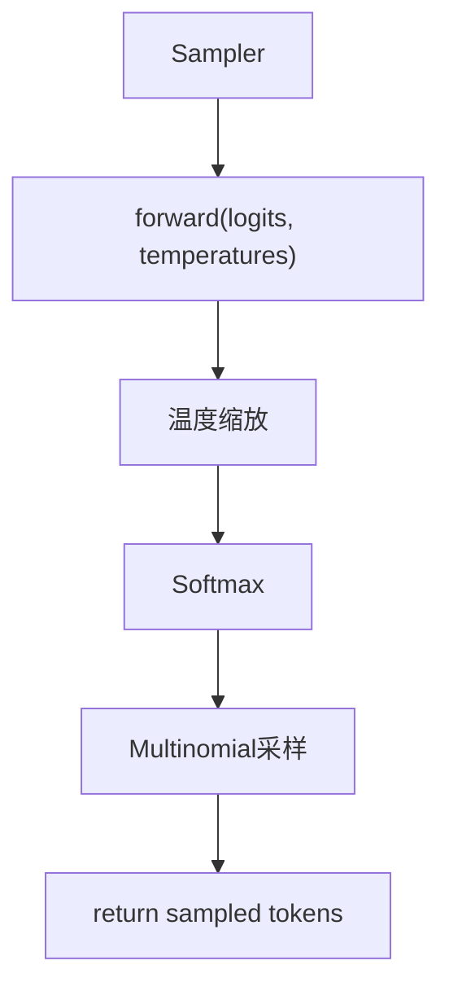
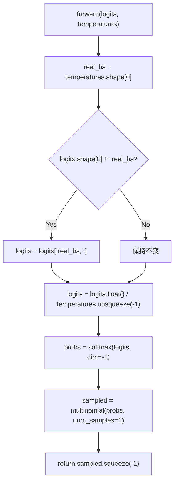
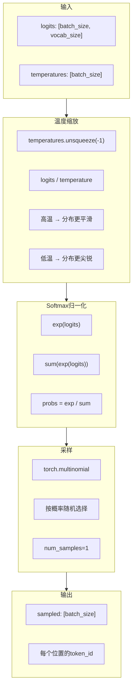
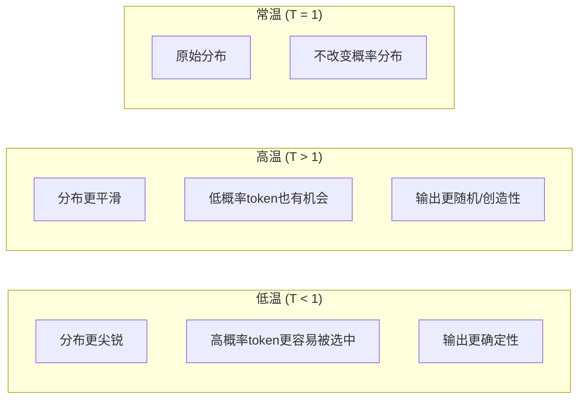
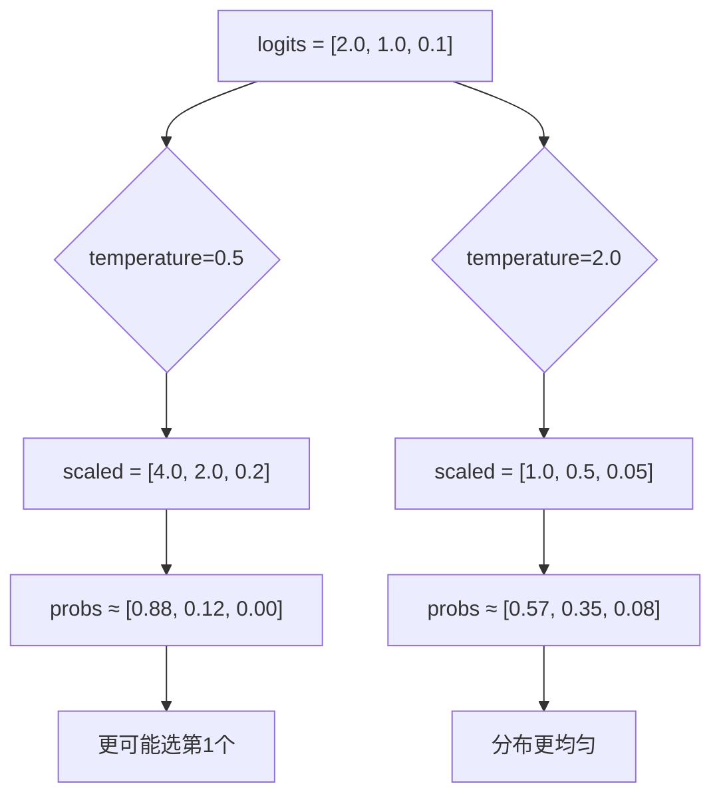

# Sampler 流程图

## Sampler 整体架构

```mermaid
flowchart TD
    A["Sampler"] --> B["forward(logits, temperatures)"]
    B --> C["温度缩放"]
    C --> D["Softmax"]
    D --> E["Multinomial采样"]
    E --> F["return sampled tokens"]
```

## 前向传播流程

```mermaid
flowchart TD
    A["forward(logits, temperatures)"] --> B["real_bs = temperatures.shape[0]"]
    B --> C{"logits.shape[0] != real_bs?"}
    C -->|Yes| D["logits = logits[:real_bs, :]"]
    C -->|No| E["保持不变"]
    D --> F["logits = logits.float() / temperatures.unsqueeze(-1)"]
    E --> F
    F --> G["probs = softmax(logits, dim=-1)"]
    G --> H["sampled = multinomial(probs, num_samples=1)"]
    H --> I["return sampled.squeeze(-1)"]
```

## 采样过程详细流程

```mermaid
flowchart TD
    subgraph Input["输入"]
        A1["logits: [batch_size, vocab_size]"]
        A2["temperatures: [batch_size]"]
    end
    
    subgraph TemperatureScaling["温度缩放"]
        B1["temperatures.unsqueeze(-1)"]
        B2["logits / temperature"]
        B3["高温 → 分布更平滑"]
        B4["低温 → 分布更尖锐"]
    end
    
    subgraph Softmax["Softmax归一化"]
        C1["exp(logits)"]
        C2["sum(exp(logits))"]
        C3["probs = exp / sum"]
    end
    
    subgraph Sampling["采样"]
        D1["torch.multinomial"]
        D2["按概率随机选择"]
        D3["num_samples=1"]
    end
    
    subgraph Output["输出"]
        E1["sampled: [batch_size]"]
        E2["每个位置的token_id"]
    end
    
    Input --> TemperatureScaling
    TemperatureScaling --> Softmax
    Softmax --> Sampling
    Sampling --> Output
```

## 温度参数影响

```mermaid
flowchart LR
    subgraph LowTemp["低温 (T < 1)"]
        A["分布更尖锐"]
        B["高概率token更容易被选中"]
        C["输出更确定性"]
    end
    
    subgraph HighTemp["高温 (T > 1)"]
        D["分布更平滑"]
        E["低概率token也有机会"]
        F["输出更随机/创造性"]
    end
    
    subgraph NormalTemp["常温 (T = 1)"]
        G["原始分布"]
        H["不改变概率分布"]
    end
```

## 采样示例

```mermaid
flowchart TD
    A["logits = [2.0, 1.0, 0.1]"] --> B{"temperature=0.5"}
    B --> C["scaled = [4.0, 2.0, 0.2]"]
    C --> D["probs ≈ [0.88, 0.12, 0.00]"]
    D --> E["更可能选第1个"]
    
    A --> F{"temperature=2.0"}
    F --> G["scaled = [1.0, 0.5, 0.05]"]
    G --> H["probs ≈ [0.57, 0.35, 0.08]"]
    H --> I["分布更均匀"]
```
