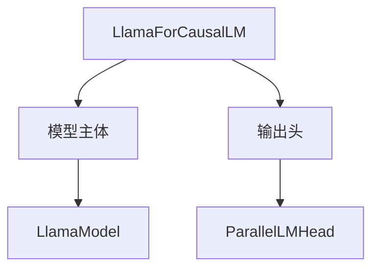
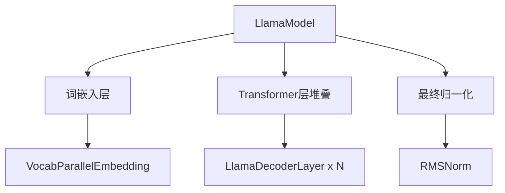
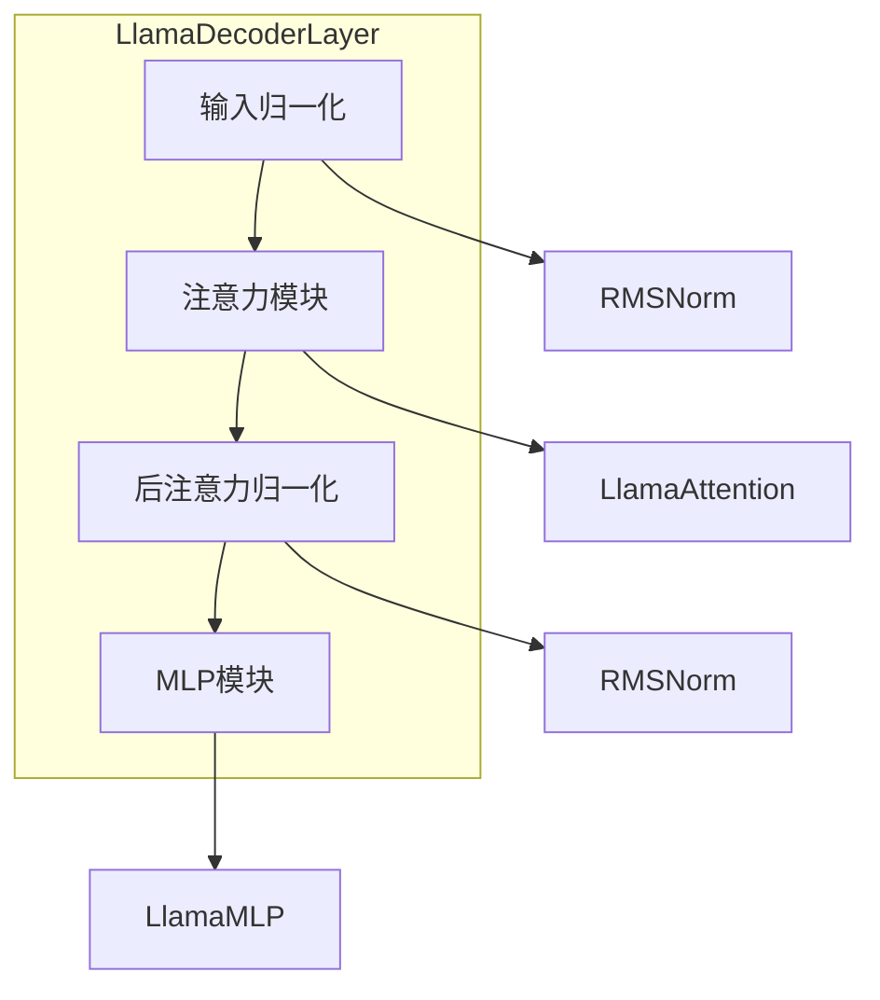
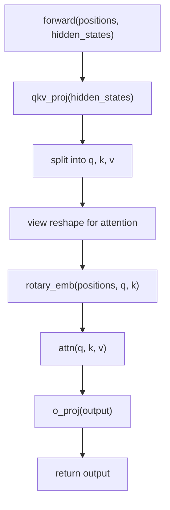
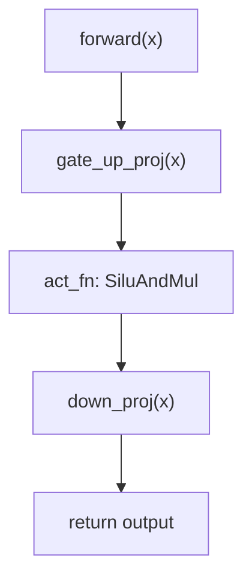
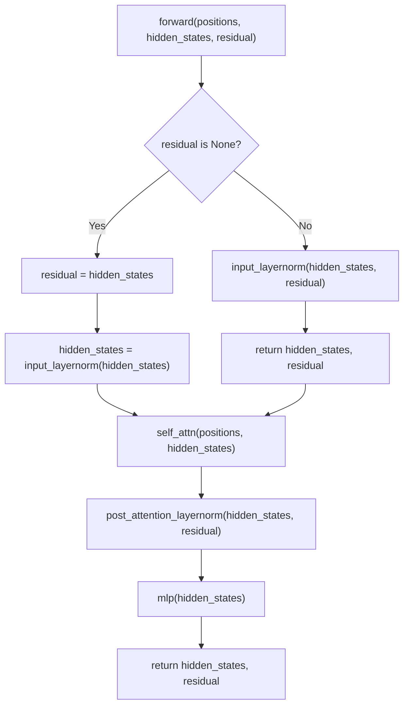
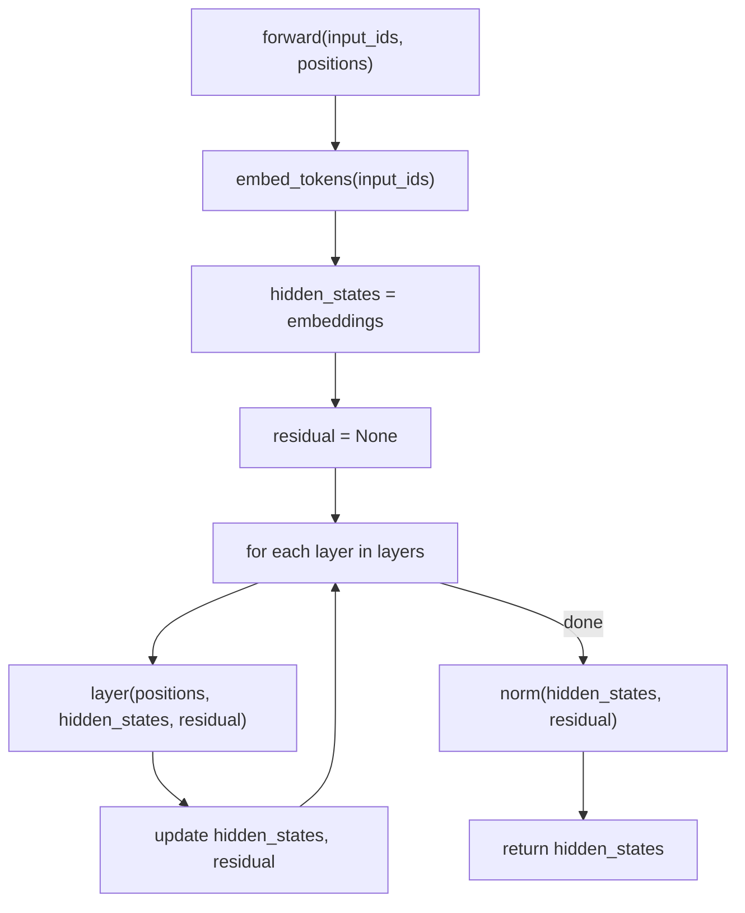
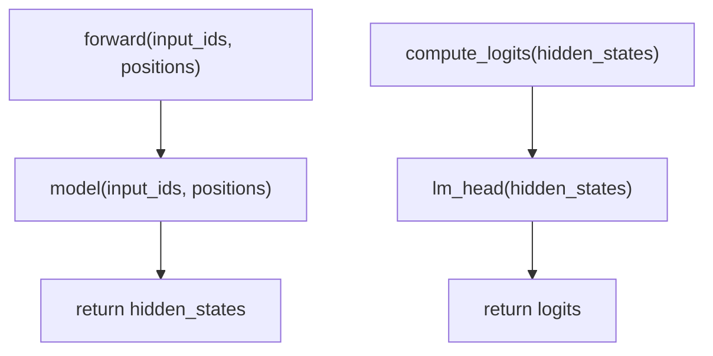
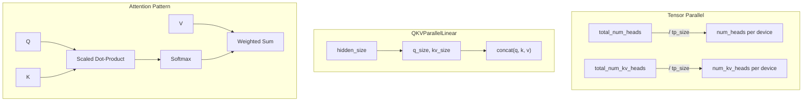
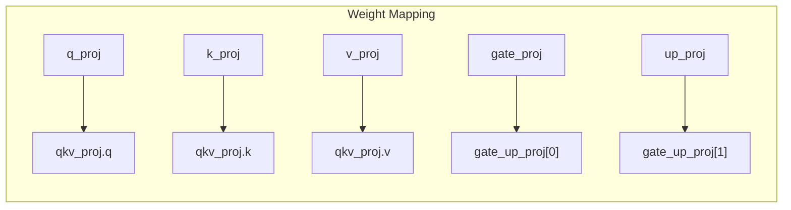

# Llama 模型流程图

## Llama 整体架构

### 顶层结构

### 模型主体层次

### Decoder Layer 内部

## LlamaAttention 前向传播

## LlamaMLP 前向传播

## LlamaDecoderLayer 前向传播

## LlamaModel 前向传播

## LlamaForCausalLM 前向传播

## 张量并行切分

## Packed Modules Mapping

