# MiniCPM4 模型流程图

## MiniCPM4 整体架构

### 顶层结构

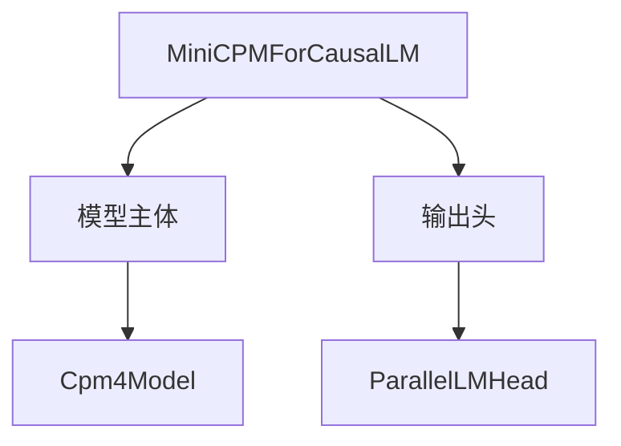

### 模型主体层次

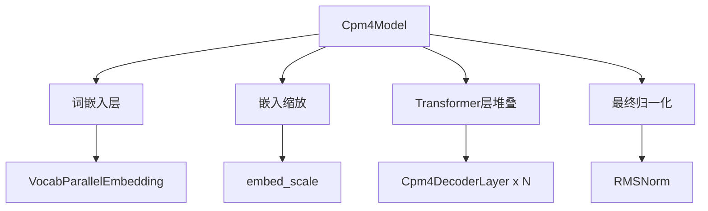

### Decoder Layer 内部

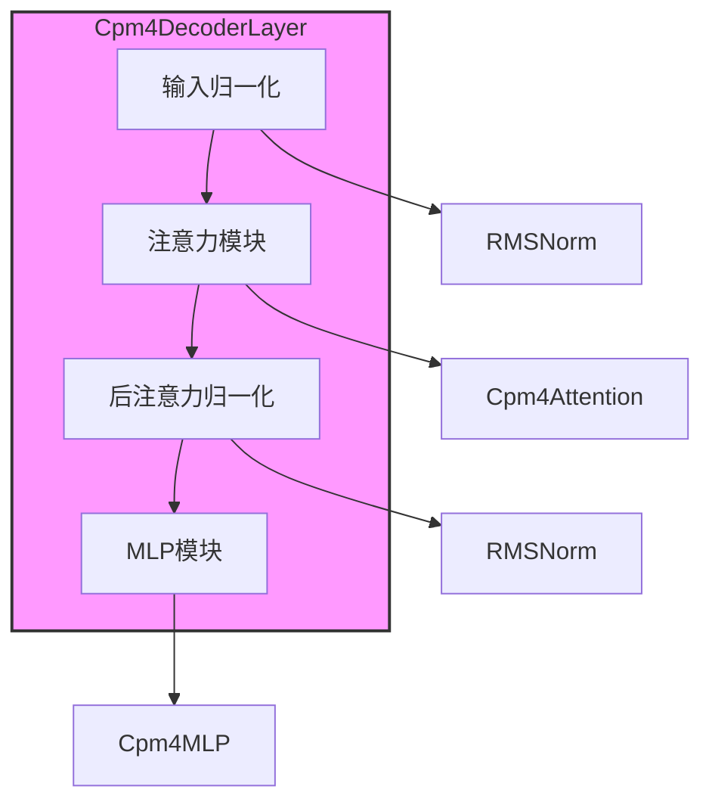

### MiniCPM4 特有组件

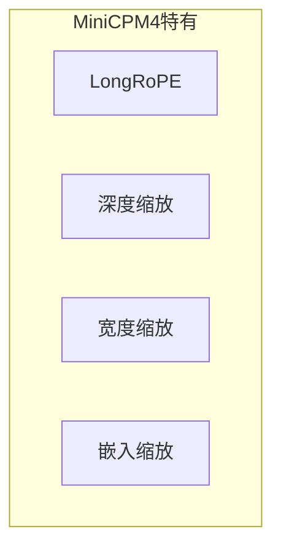

## LongRoPE Implementation

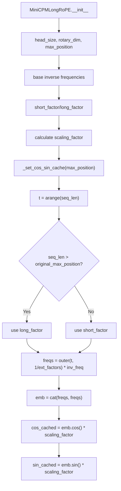

## MiniCPMLongRoPE Forward

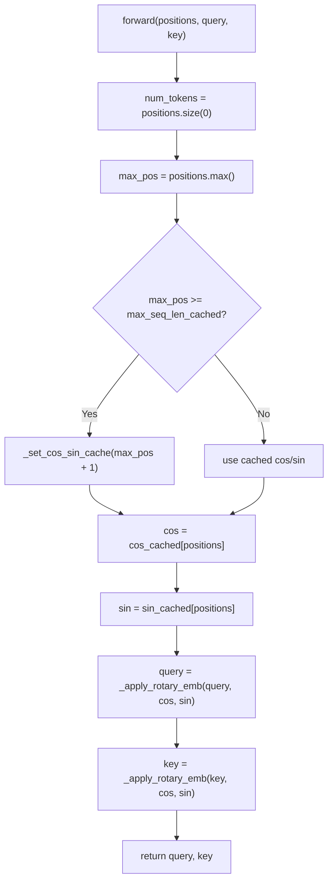

## Apply Rotary Embedding

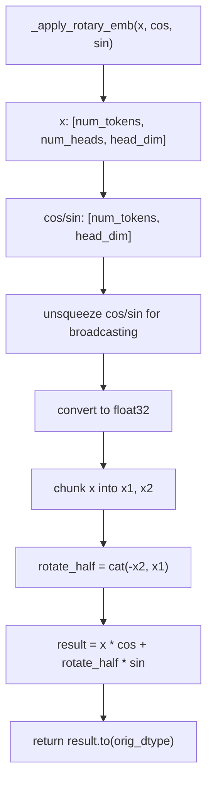

## Cpm4Attention Forward

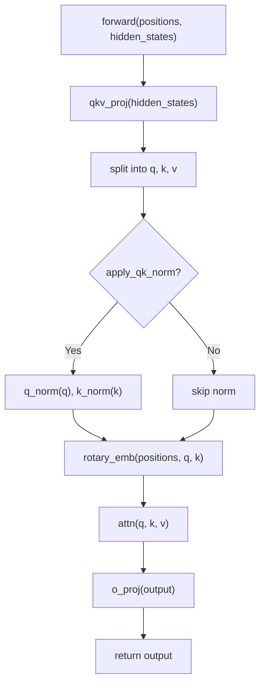

## Cpm4DecoderLayer Forward

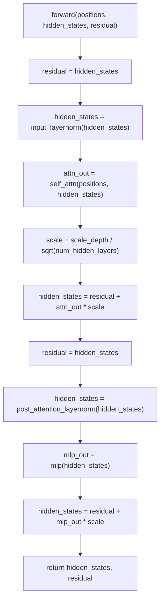

## Cpm4Model Forward

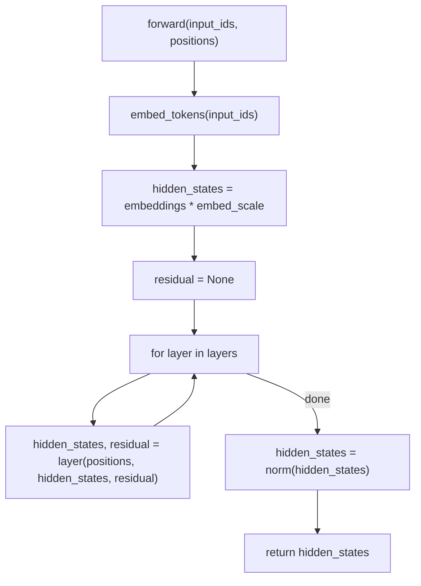

## MiniCPMForCausalLM Forward

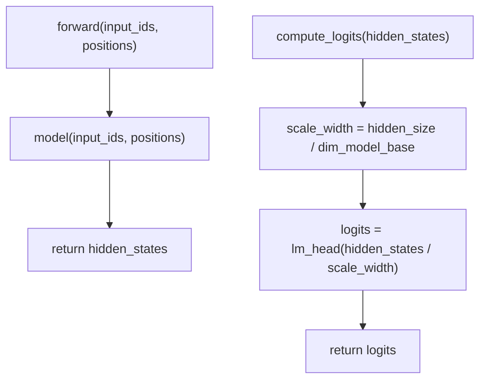

## MiniCPM vs Standard Transformer

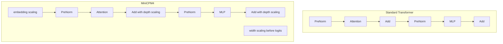

## Scaling Factors

```mermaid
flowchart TD
    subgraph DepthScaling["Depth Scaling"]
        A["scale_depth"] --> B["default = 1.0"]
        B --> C["per-layer scale = scale_depth / sqrt(num_hidden_layers)"]
        C --> D["applied to both attn and mlp outputs"]
    end

    subgraph WidthScaling["Width Scaling"]
        E["scale_width"] --> F["hidden_size / dim_model_base"]
        F --> G["applied before lm_head"]
        G --> H["hidden_states = hidden_states / scale_width"]
    end

    subgraph EmbedScaling["Embedding Scaling"]
        I["scale_emb"] --> J["default = 1.0"]
        J --> K["embed_tokens * scale_emb"]
    end
```

## get_cpm4_rope

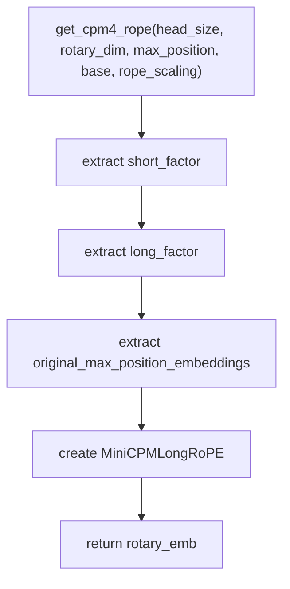

## Key Features

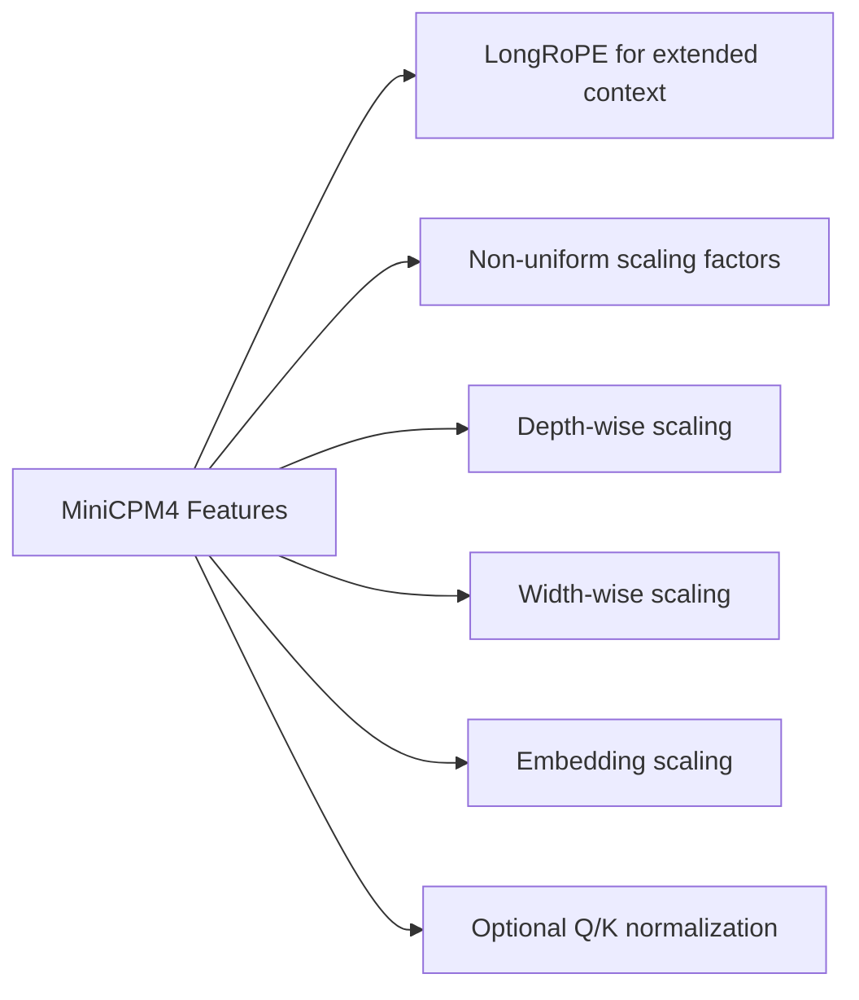
