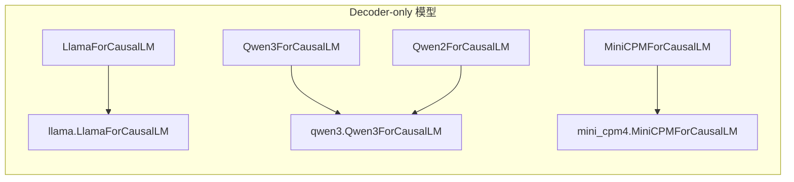
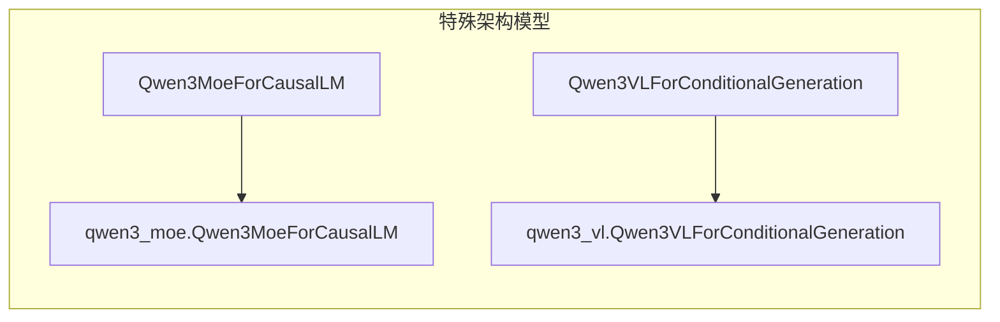
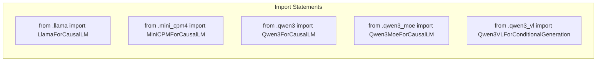
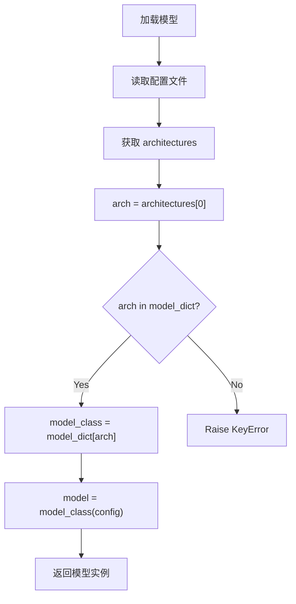
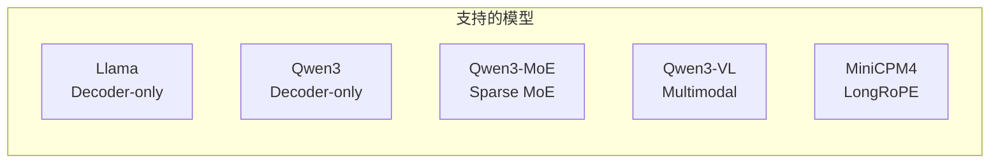
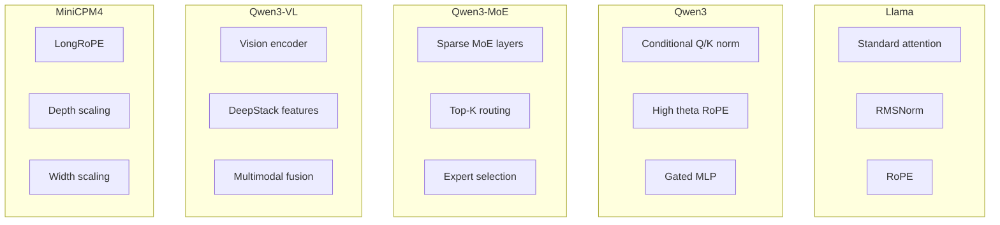
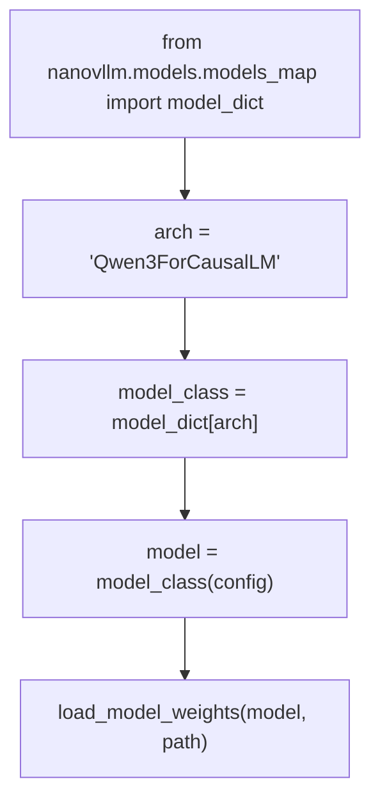
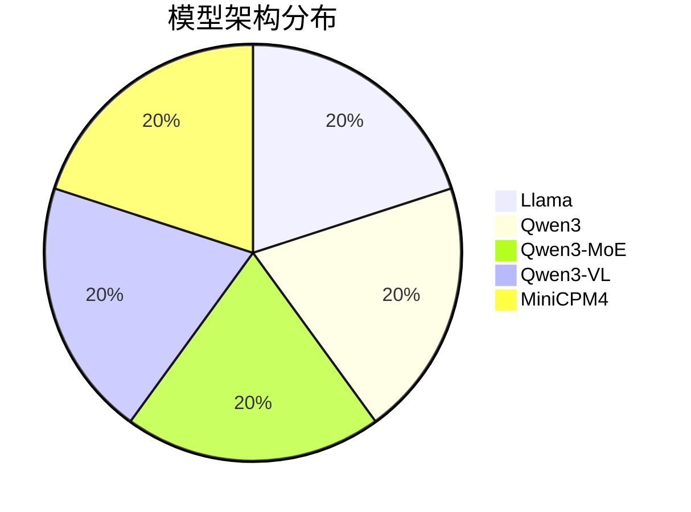
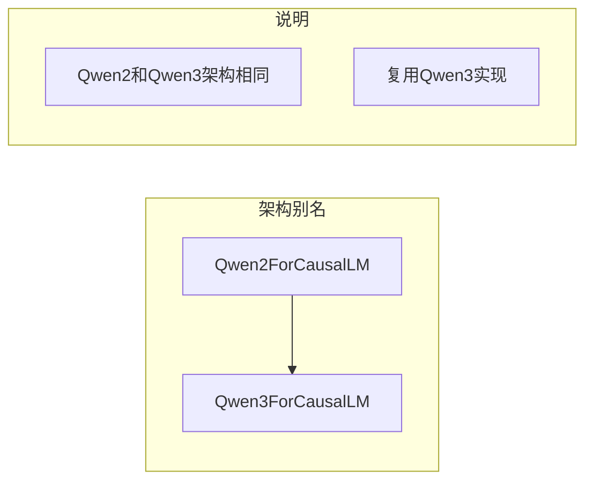

# Models Map 流程图

## 模型映射关系

### 架构名称到实现类的映射

### 映射表

| 架构名称 | 实现类 | 类型 |
|---------|--------|------|
| LlamaForCausalLM | llama.LlamaForCausalLM | Decoder-only |
| Qwen2ForCausalLM | qwen3.Qwen3ForCausalLM | Decoder-only |
| Qwen3ForCausalLM | qwen3.Qwen3ForCausalLM | Decoder-only |
| Qwen3MoeForCausalLM | qwen3_moe.Qwen3MoeForCausalLM | Sparse MoE |
| Qwen3VLForConditionalGeneration | qwen3_vl.Qwen3VLForConditionalGeneration | Multimodal |
| MiniCPMForCausalLM | mini_cpm4.MiniCPMForCausalLM | Decoder-only |

## 模型导入关系

## 模型选择流程

## 支持的模型架构

## 模型特点对比

## 使用示例

## 模型类别分布

## 架构别名映射

