# Qwen3 模型流程图

## Qwen3 整体架构

### 顶层结构

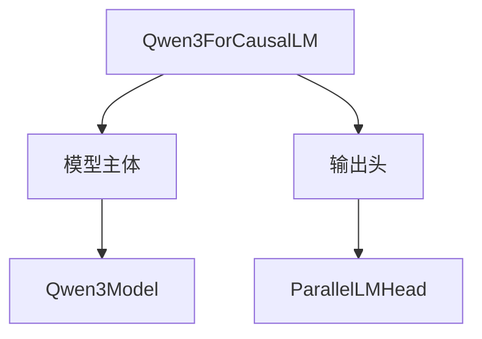

### 模型主体层次

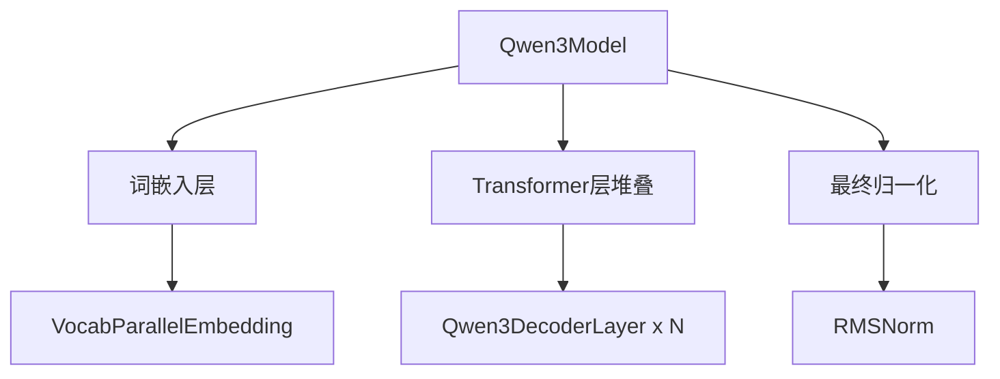

### Decoder Layer 内部

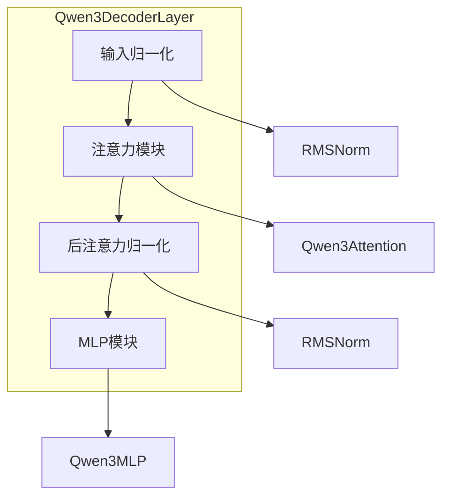

## Qwen3Attention 前向传播

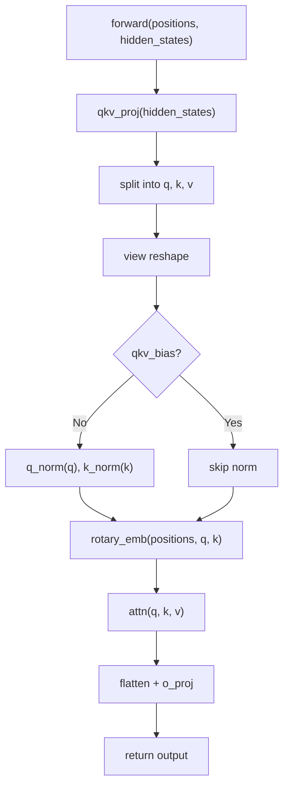

## Qwen3MLP 前向传播

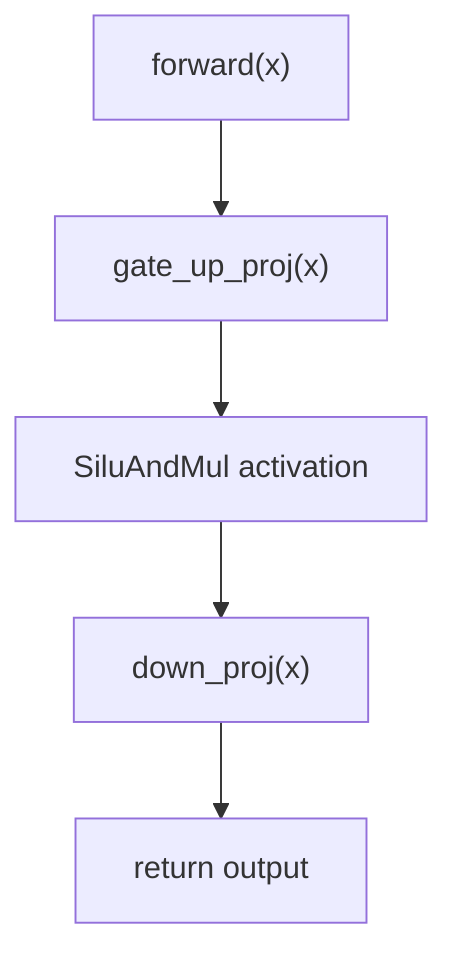

## Qwen3DecoderLayer 前向传播

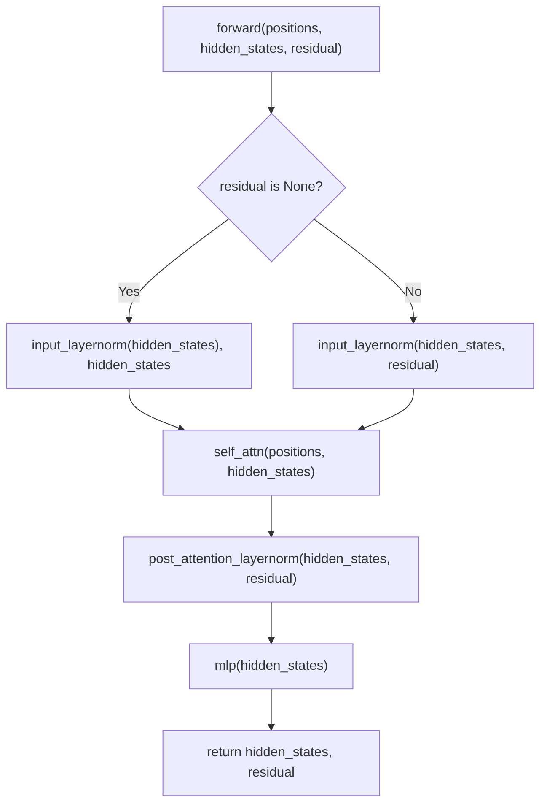

## Qwen3Model 前向传播

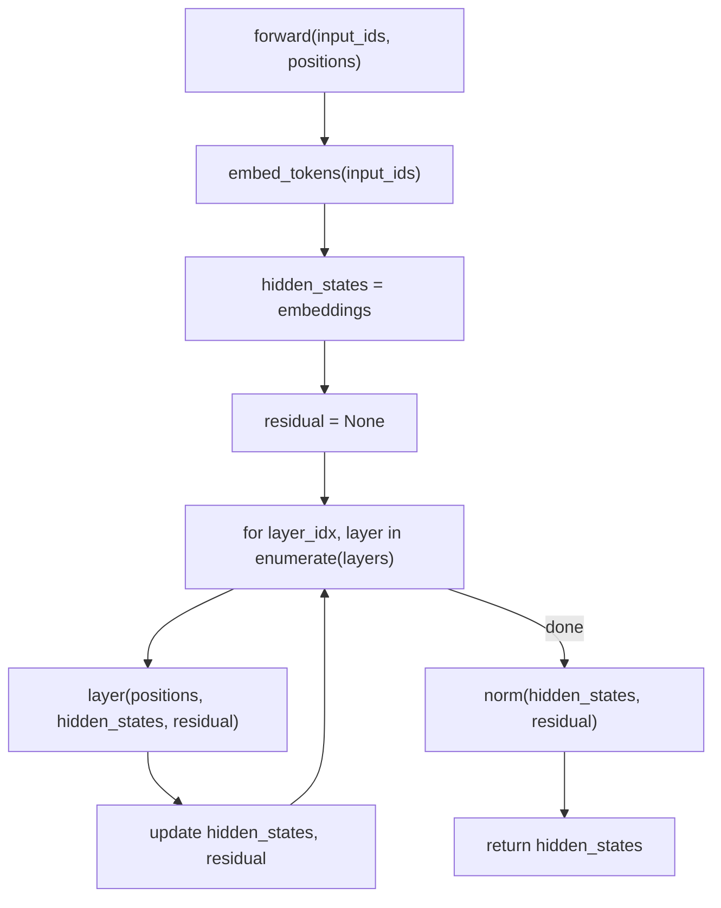

## Qwen3ForCausalLM 前向传播

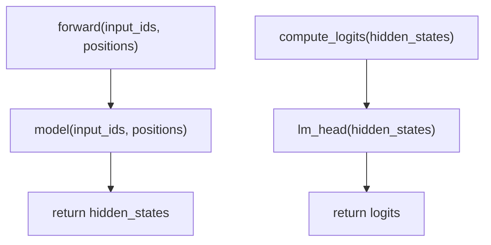

## Packed Modules Mapping

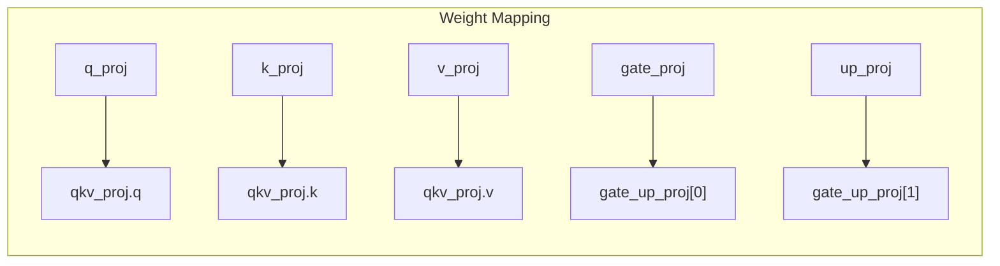

## Qwen3 vs Llama 关键区别

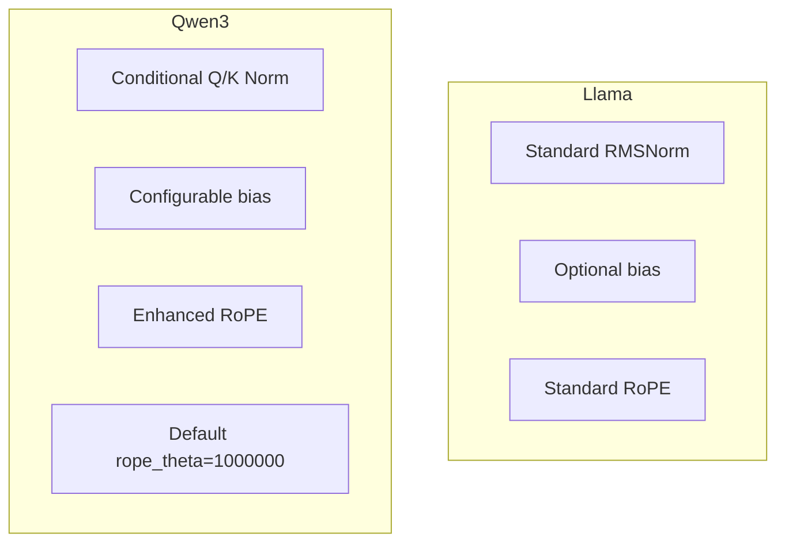

## 配置参数继承

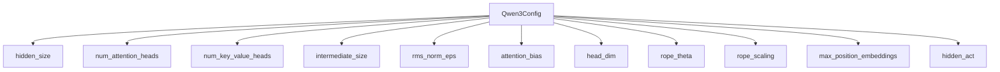
