# Qwen3-MoE 模型流程图

## Qwen3-MoE 整体架构

### 顶层结构

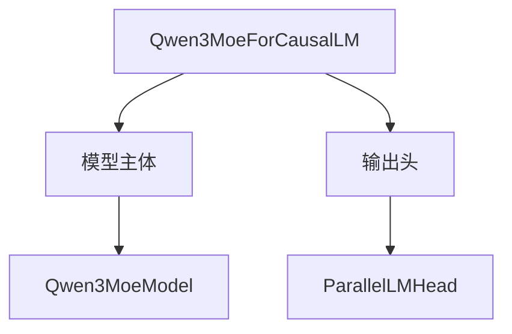

### 模型主体层次

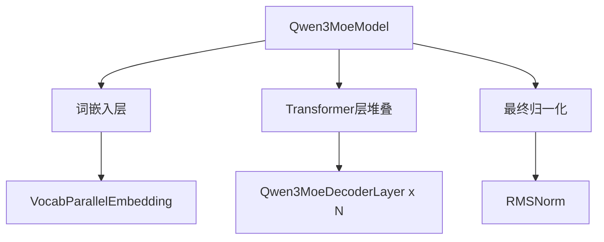

### Decoder Layer 内部

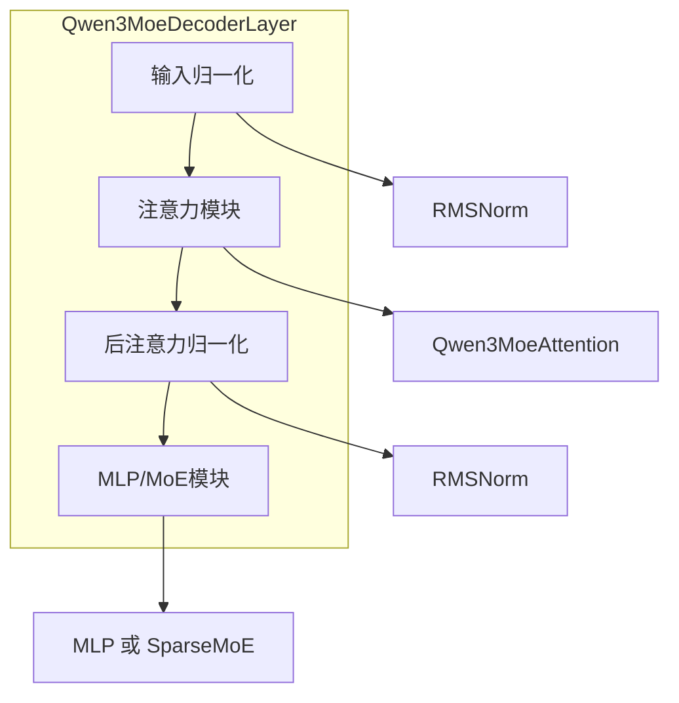

## MoE Layer Selection

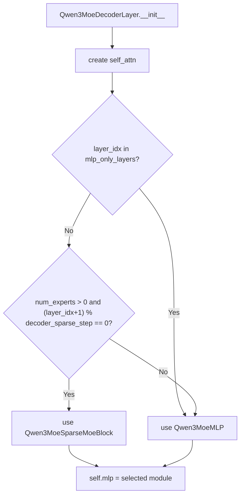

## Sparse MoE Block 前向传播

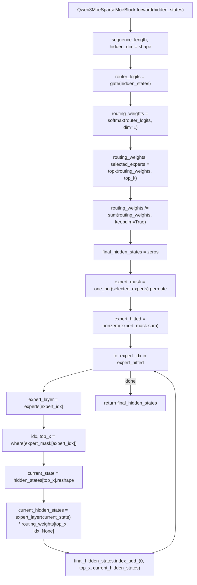

## Qwen3MoeAttention 前向传播

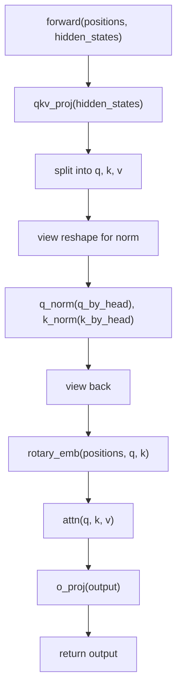

## Standard MLP vs MoE MLP

```mermaid
flowchart TD
    subgraph Standard["Qwen3MoeMLP (Standard)"]
        A["forward(x)"] --> B["gate_up_proj(x)"]
        B --> C["SiluAndMul"]
        C --> D["down_proj"]
        D --> E["return output"]
    end

    subgraph MoE["Qwen3MoeSparseMoeBlock (Sparse)"]
        F["forward(hidden_states)"] --> G["gate(hidden_states)"]
        G --> H["softmax -> top_k"]
        H --> I["select top_k experts"]
        I --> J["route to selected experts"]
        J --> K["weighted aggregation"]
        K --> L["return output"]
    end
```

## Decoder Layer Forward

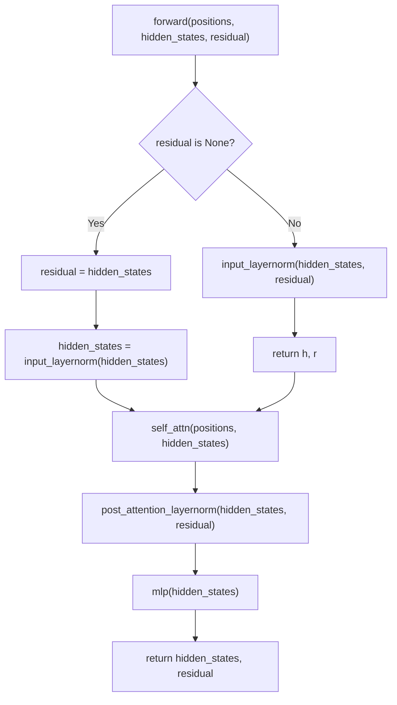

## Model Forward

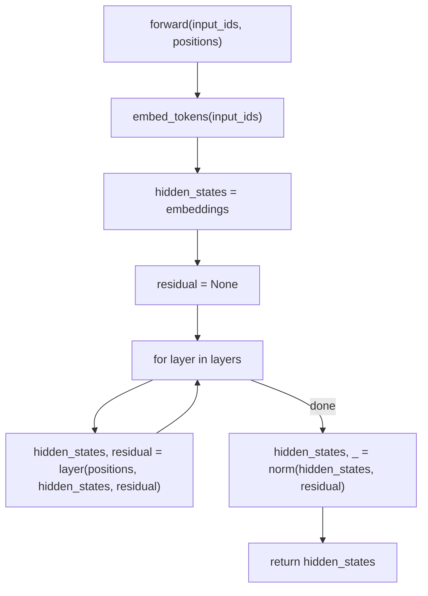

## CausalLM Forward

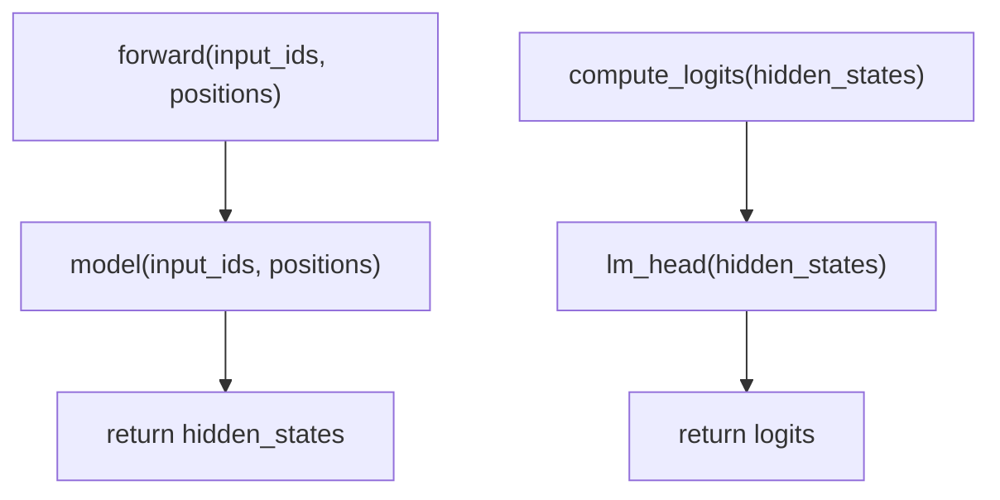

## MoE Configuration

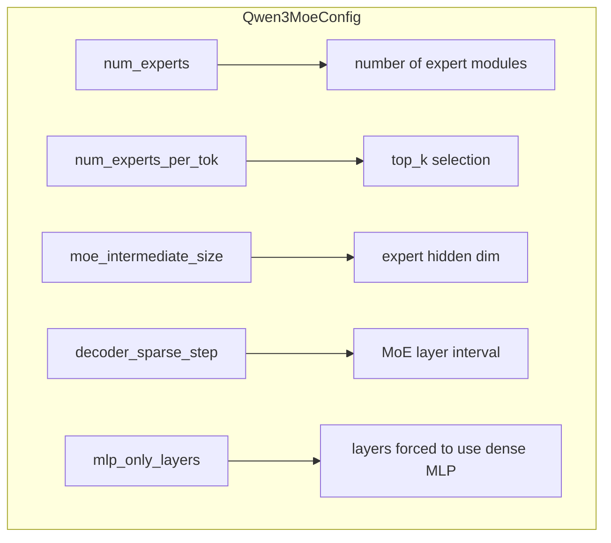

## Expert Selection Process

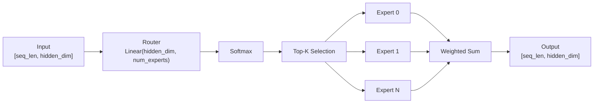

## Mask-Based Expert Routing

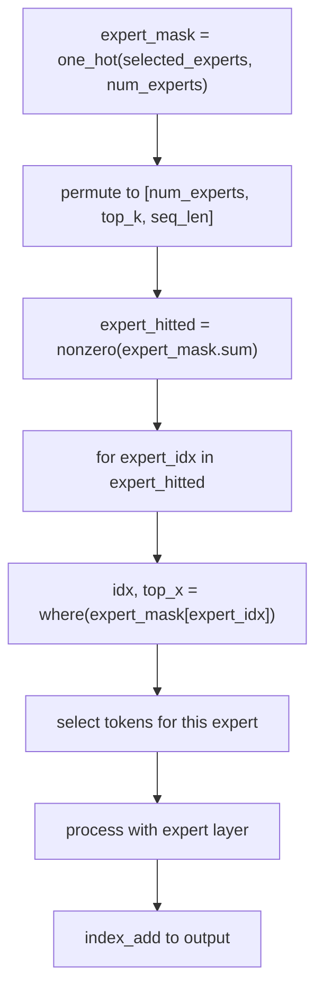
