# Qwen3-VL 多模态模型流程图

## Qwen3-VL 整体架构

### 顶层结构

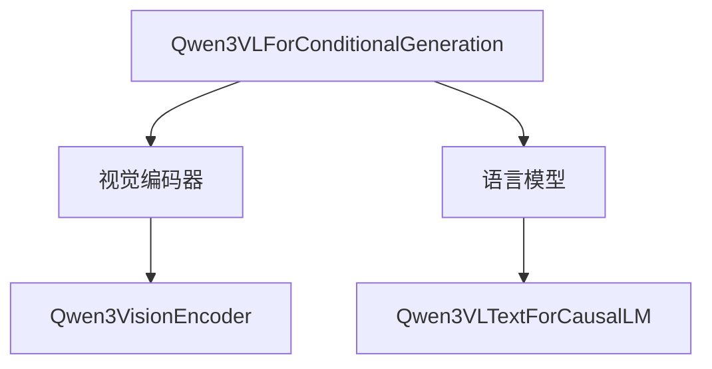

### 视觉编码器结构

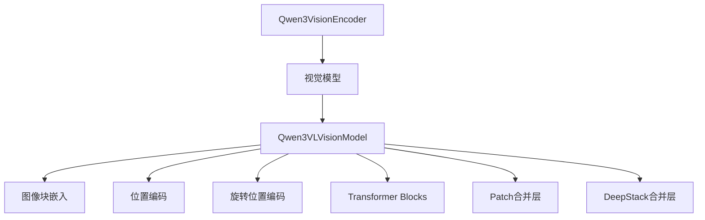

### 视觉模型组件

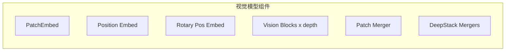

### 语言模型结构

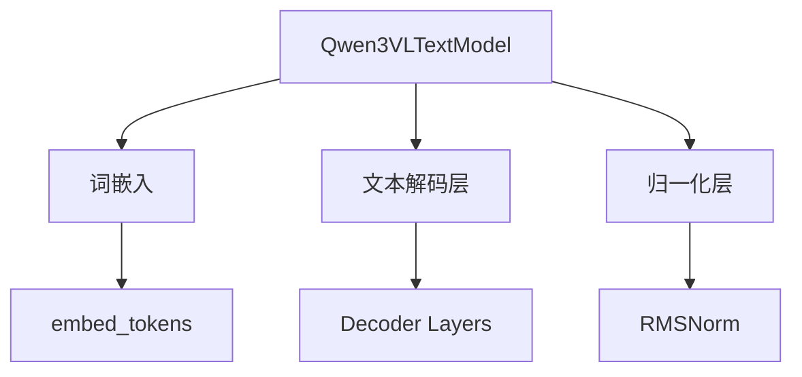

## Vision Encoder 前向传播

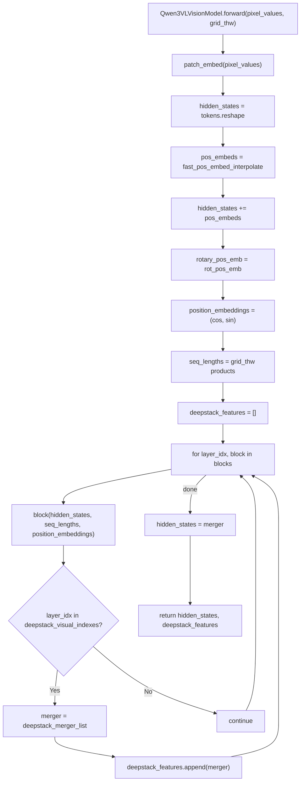

## Vision Patch Embed

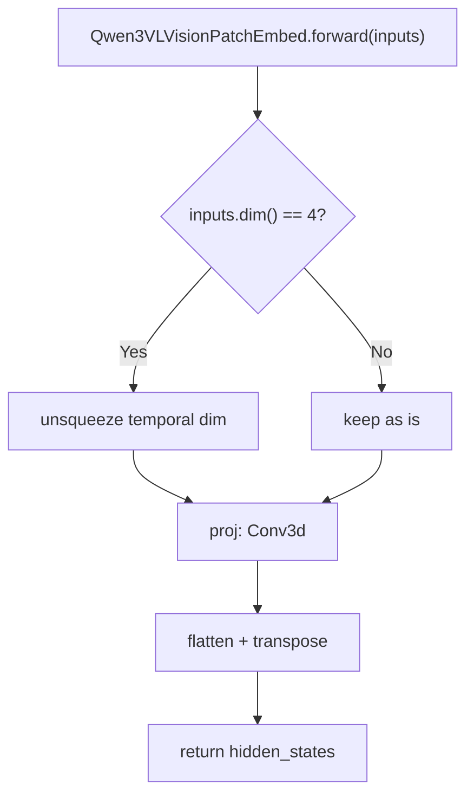

## Vision Block

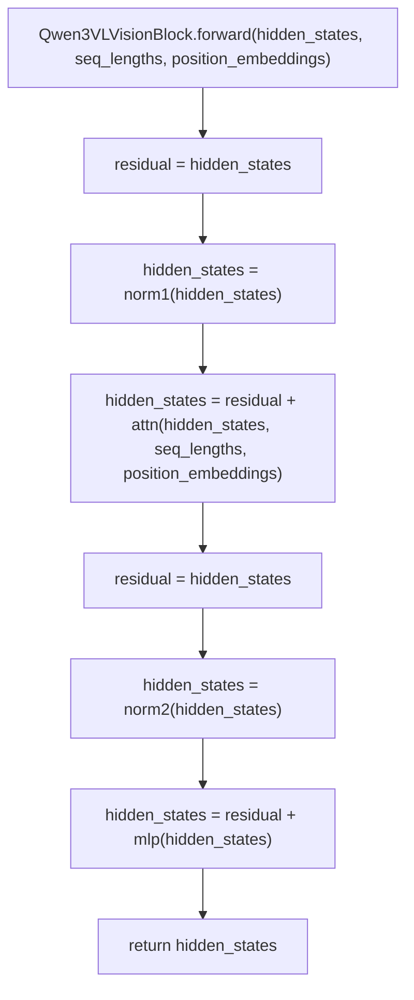

## Vision Attention

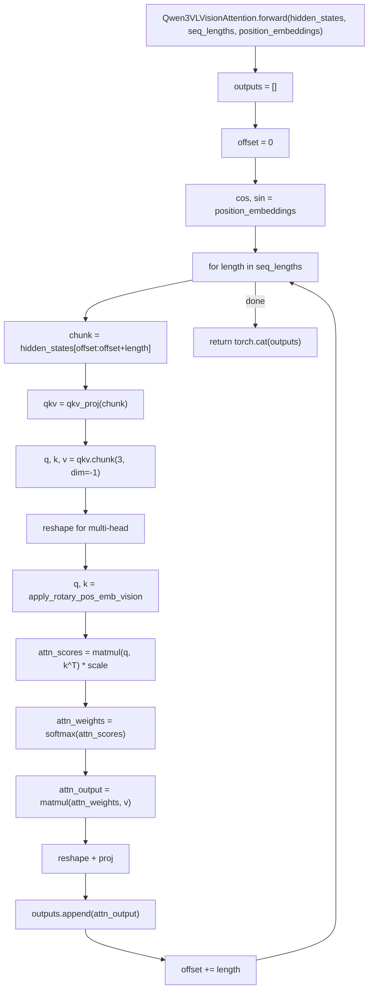

## Multimodal Forward

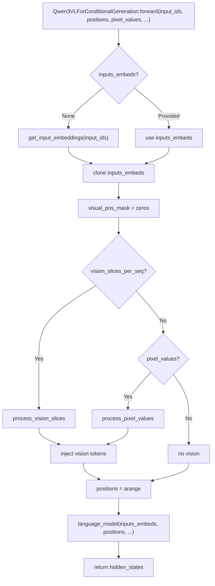

## Process Vision Slices

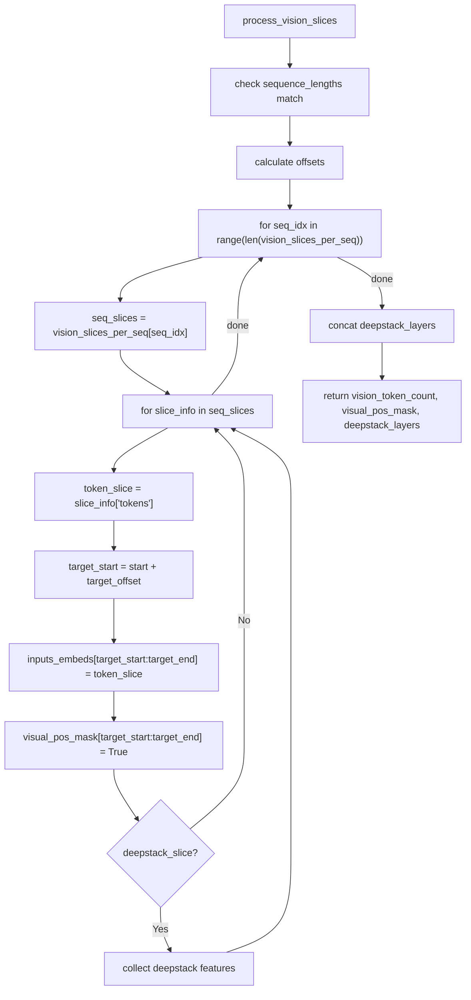

## Load Model

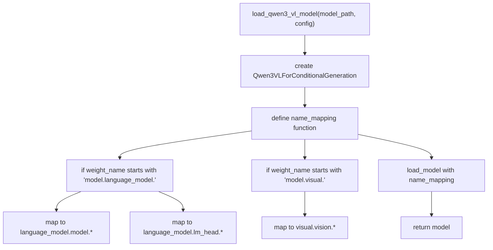

## Vision Position Interpolation

```mermaid
flowchart TD
    A["fast_pos_embed_interpolate(grid_thw)"] --> B["grid_ts, grid_hs, grid_ws = grid_thw"]
    B --> C["for t, h, w in zip"]
    C --> D["h_idxs = linspace(0, num_grid_per_side-1, h)"]
    D --> E["w_idxs = linspace(0, num_grid_per_side-1, w)"]
    E --> F["calculate floor/ceil indices"]
    F --> G["calculate interpolation weights"]
    G --> H["4-corner bilinear interpolation"]
    H --> I["C -->|"done"| J["sum weighted embeddings"]
    J --> K["permute and flatten"]
    K --> L["return patch_pos_embeds"]
```

## Text Decoder Layer with DeepStack

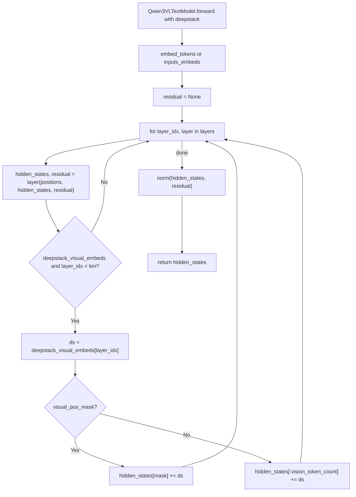

## Rotational Position Embedding (Vision)

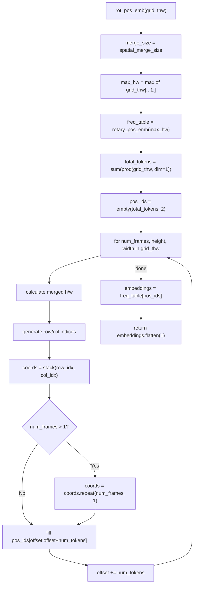
